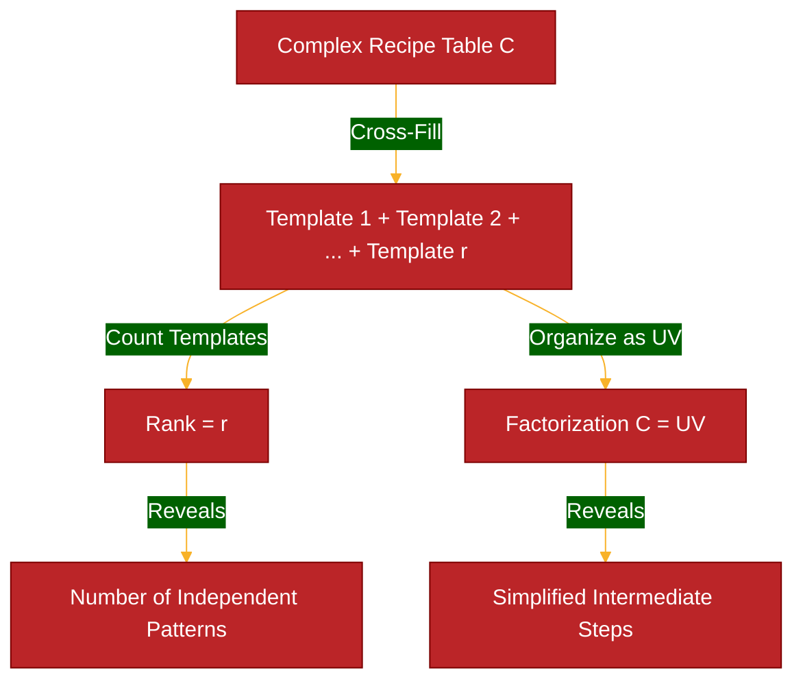

# Week 2-3: Cross-Filling Method

> **Topics**: §1.3 — Rank-One Decomposition, Cross-Filling Algorithm, Sum ↔ Product Equivalence
> **Date**: Mar 2–12, 2026

---

## Introduction

In Lecture 1, we discovered that every matrix product $AB$ can be written as a **sum of rank-one matrices**:

$$AB = \mathbf{a}_1 \mathbf{b}_1^T + \mathbf{a}_2 \mathbf{b}_2^T + \cdots + \mathbf{a}_n \mathbf{b}_n^T$$

This perspective was presented as "just another view" of matrix multiplication. **This week, we reverse the question**: Can we take an **arbitrary matrix $A$** and decompose it into rank-one pieces, even when it wasn't obtained as a product?

**The answer is yes**, and the algorithm for doing this is called **cross-filling** (also known as **rank-one peeling** or **outer product decomposition**). This is the **central computational technique** of the entire course.

---

## §1.3 The Cross-Filling Method

### Motivating Question: Reversing the Production Chain

Recall our coffee shop from Lecture 1. We have a direct recipe table from raw materials to final products:

$$C = \begin{array}{c|cc}
 & \text{Set 1 🍱} & \text{Set 2 🍜} \\
\hline
\text{Leaf 🍃} & 2 & 2 \\
\text{Lemon 🍋} & 1 & 1 \\
\text{Bean 🫘} & 0 & 4 \\
\text{Cow 🐄} & 2 & 1
\end{array} = \begin{pmatrix}
2 & 2 \\
1 & 1 \\
0 & 4 \\
2 & 1
\end{pmatrix}$$

**Question**: We know this came from composing two recipe tables $C = AB$, but what if we **forgot** what the intermediate products were? Can we **recover** the semi-finished products (🥛☕🍵) from just the direct recipe $C$?

**Why does this matter?** In real applications:
- We often observe the **final result** (matrix $C$) directly
- We don't know the **hidden intermediate steps** that produced it
- Finding the intermediate structure reveals **simplified recipes** and **redundancies**

This reverse engineering process is called **cross-filling** or **rank-one peeling**.

---

### A Simpler Example: The Coffee Stand

Let's start with an even simpler scenario to understand the core idea.

**Scenario**: A small coffee stand makes only 2 final products (🍱 Set 1, 🍜 Set 2) from 3 raw materials (🍃 Leaf, 🍋 Lemon, 🫘 Bean):

$$C = \begin{array}{c|cc}
 & \text{🍱} & \text{🍜} \\
\hline
\text{🍃} & 2 & 4 \\
\text{🍋} & 1 & 2 \\
\text{🫘} & 3 & 6
\end{array} = \begin{pmatrix}
2 & 4 \\
1 & 2 \\
3 & 6
\end{pmatrix}$$

**Observation**: Look at the two columns (the two meal sets):
- Set 1 (🍱): needs $(2\text{🍃}, 1\text{🍋}, 3\text{🫘})$
- Set 2 (🍜): needs $(4\text{🍃}, 2\text{🍋}, 6\text{🫘})$

**Notice**: Set 2 uses **exactly twice** as much of every ingredient as Set 1!

$$\text{🍜} = 2 \times \text{🍱}$$

This suggests there's really only **one basic recipe pattern**, and the two meal sets are just different portions of the same pattern.

**In other words**: The entire table $C$ can be built from a **single template**:

$$C = (\text{ingredient amounts}) \times (\text{portion sizes})$$

Let's make this precise.

---

### The Template: Rank-One Production

Define:
- **Recipe template** (ingredient column): $\mathbf{u} = \begin{pmatrix} 2 \\ 1 \\ 3 \end{pmatrix}$ for $(\text{🍃}, \text{🍋}, \text{🫘})$
- **Portion multipliers** (how much of template for each product): $\mathbf{v}^T = \begin{pmatrix} 1 & 2 \end{pmatrix}$ for $($ 🍱, 🍜 $)$

**Building the full table**:

For Set 1 (🍱): Use $1 \times$ the template:
$$\text{Set 1 amounts} = 1 \cdot \begin{pmatrix} 2 \\ 1 \\ 3 \end{pmatrix} = \begin{pmatrix} 2 \\ 1 \\ 3 \end{pmatrix}$$

For Set 2 (🍜): Use $2 \times$ the template:
$$\text{Set 2 amounts} = 2 \cdot \begin{pmatrix} 2 \\ 1 \\ 3 \end{pmatrix} = \begin{pmatrix} 4 \\ 2 \\ 6 \end{pmatrix}$$

**Combining columns**:
$$C = \begin{pmatrix}
| & | \\
1\mathbf{u} & 2\mathbf{u} \\
| & |
\end{pmatrix} = \begin{pmatrix} 2 & 4 \\ 1 & 2 \\ 3 & 6 \end{pmatrix}$$

**Matrix notation**:
$$C = \mathbf{u} \mathbf{v}^T = \begin{pmatrix} 2 \\ 1 \\ 3 \end{pmatrix} \begin{pmatrix} 1 & 2 \end{pmatrix}$$

Let's verify by multiplying out:
$$\mathbf{u} \mathbf{v}^T = \begin{pmatrix} 2 \\ 1 \\ 3 \end{pmatrix} \begin{pmatrix} 1 & 2 \end{pmatrix} = \begin{pmatrix}
2 \cdot 1 & 2 \cdot 2 \\
1 \cdot 1 & 1 \cdot 2 \\
3 \cdot 1 & 3 \cdot 2
\end{pmatrix} = \begin{pmatrix}
2 & 4 \\
1 & 2 \\
3 & 6
\end{pmatrix} \quad ✓$$

**Key insight**: Instead of storing 6 numbers (3 rows × 2 columns), we only need 5 numbers:
- 3 numbers in $\mathbf{u}$ (the template)
- 2 numbers in $\mathbf{v}^T$ (the multipliers)

This **factorization** $C = \mathbf{u} \mathbf{v}^T$ reveals the hidden structure: the recipe table has only **one independent pattern**.

::: remark
**Terminology: Rank-One Matrix**

A matrix that can be written as $\mathbf{u} \mathbf{v}^T$ (column vector times row vector) is called a **rank-one matrix**.

**Why "rank-one"?** Because it has only one independent pattern — all columns are multiples of the same template $\mathbf{u}$, and all rows are multiples of the same pattern $\mathbf{v}^T$.

**Visual property**: In a rank-one matrix, any four entries forming a rectangle satisfy:
$$c_{ij} \cdot c_{k\ell} = c_{i\ell} \cdot c_{kj}$$

For example: $c_{11} \cdot c_{22} = (2)(2) = 4 = (4)(1) = c_{12} \cdot c_{21}$ ✓

This is the **cross-filling property** — drawing a cross ✕ through any 2×2 submatrix, the diagonal products equal the anti-diagonal products.
:::

---

### What If the Table Isn't Rank-One?

Not all tables have this simple structure. Consider:

$$C = \begin{array}{c|cc}
 & \text{🍱} & \text{🍜} \\
\hline
\text{🍃} & 2 & 4 \\
\text{🍋} & 1 & 2 \\
\text{🫘} & 3 & 7
\end{array} = \begin{pmatrix}
2 & 4 \\
1 & 2 \\
3 & 7
\end{pmatrix}$$

**Check**: Is Set 2 a multiple of Set 1?
- $\frac{4}{2} = 2$ (🍃 ratio)
- $\frac{2}{1} = 2$ (🍋 ratio)
- $\frac{7}{3} = 2.33...$ (🫘 ratio) ← **Different!**

The ratios don't match, so this table **cannot** be written as $\mathbf{u} \mathbf{v}^T$.

**But here's the key idea**: We can **approximate** it as rank-one, then analyze the **remainder**.

---

### The Cross-Filling Algorithm: Peeling Off One Layer

**Strategy**: Build $C$ by adding simple (rank-one) pieces one at a time.

**Step 1**: Choose a **pivot** entry (any nonzero entry), say $c_{11} = 2$ (🍃 needed for 🍱)

**Step 2**: Use row 1 and column 1 to form a rank-one template:
- Template column: $\begin{pmatrix} 2 \\ 1 \\ 3 \end{pmatrix}$ (ingredients for Set 1)
- Template row: $\begin{pmatrix} 2 & 4 \end{pmatrix}$ (🍃 usage across products)

**Step 3**: Build rank-one piece $R_1$ so that $(R_1)_{11} = c_{11}$:

Divide row by pivot: $\begin{pmatrix} 2 & 4 \end{pmatrix} / 2 = \begin{pmatrix} 1 & 2 \end{pmatrix}$

$$R_1 = \begin{pmatrix} 2 \\ 1 \\ 3 \end{pmatrix} \begin{pmatrix} 1 & 2 \end{pmatrix} = \begin{pmatrix}
\color{red}2 & \color{red}4 \\
\color{red}1 & \color{red}2 \\
\color{red}3 & \color{red}6
\end{pmatrix}$$

**Step 4**: Compute the **remainder** (what's left after peeling off $R_1$):

$$C_2 = C - R_1 = \begin{pmatrix}
2 & 4 \\
1 & 2 \\
3 & 7
\end{pmatrix} - \begin{pmatrix}
2 & 4 \\
1 & 2 \\
3 & 6
\end{pmatrix} = \begin{pmatrix}
\color{blue}0 & \color{blue}0 \\
\color{blue}0 & \color{blue}0 \\
\color{blue}0 & \color{blue}1
\end{pmatrix}$$

**Observe**: Row 1 and column 1 are now **completely zero**! The rank-one piece "filled in" that cross-shaped region.

**Step 5**: The remainder $C_2$ is much simpler (only one nonzero entry). It's also rank-one:

$$C_2 = \begin{pmatrix} 0 \\ 0 \\ 1 \end{pmatrix} \begin{pmatrix} 0 & 1 \end{pmatrix} = \begin{pmatrix}
0 & 0 \\
0 & 0 \\
0 & 1
\end{pmatrix} = R_2$$

**Final result**:
$$C = R_1 + R_2 = \begin{pmatrix}
2 & 4 \\
1 & 2 \\
3 & 6
\end{pmatrix} + \begin{pmatrix}
0 & 0 \\
0 & 0 \\
0 & 1
\end{pmatrix} = \begin{pmatrix}
2 & 4 \\
1 & 2 \\
3 & 7
\end{pmatrix}$$

**Interpretation**: The coffee stand's recipe can be understood as:
- **Template 1** (main recipe): All products based on $(2\text{🍃}, 1\text{🍋}, 3\text{🫘})$ template, scaled by $(1, 2)$ for the two sets
- **Template 2** (extra beans): Set 2 needs an extra $1\text{🫘}$ beyond the main template

This reveals that the table has **two independent patterns** (rank = 2).

---

### Visual Interpretation: The Cross-Filling Pattern

The name "cross-filling" comes from the visual pattern when peeling off rank-one pieces:

**Original table $C$**:
```
┌─────────┐
│ 2   4  │  ← Row 1
│ 1   2  │
│ 3   7  │
└─────────┘
  ↑
Column 1
```

**Choose pivot** $c_{11} = 2$ (marked with ✕):
```
┌─────────┐
│ ✕ → →  │  ← Pivot row spreads right
│ ↓      │
│ ↓      │  ← Pivot column extends down
└─────────┘
```

**After subtracting $R_1$** (cross region eliminated):
```
┌─────────┐
│ 0   0  │  ← Row 1: filled to zero
│ 0   0  │  ← Row 2: also zero (inherited from being multiple of row 1)
│ 0   1  │  ← Row 3: only entry outside the cross survives
└─────────┘
  ↑
Column 1: filled to zero
```

The pivot and its **cross** (entire row and column) get "filled in" by the rank-one piece!

---

## Motivation: Factoring Matrices

::: remark
**Analogy with factoring recipes**

- **Factoring numbers**: $12 = 3 \times 4$ (find simple components)
- **Factoring recipe tables**: $C = AB$ (find intermediate products that simplify production)

The key difference: We're not just finding **one** factorization — we want to decompose into a **sum of the simplest possible patterns** (rank-one pieces). This reveals how many truly independent recipes exist.
:::

**Our goal**: Given a recipe table (matrix) $C$, find:
1. **How many independent patterns** does it contain?
2. **What are those basic patterns** (rank-one templates)?
3. **Can we factor it** as $C = AB$ using simpler intermediate steps?

The **minimum number of patterns needed** is called the **rank** of the table.

---

### Abstract View: Rank-One Matrices

::: remark
**Change of Perspective**

In the previous sections, we used concrete coffee shop tables with emojis to understand **why** cross-filling works and **what** rank-one patterns mean.

**From this point forward**, we'll work with abstract matrices $A$, $B$, $R$ without referring back to coffee shops on every line. The logical principles remain the same:
- Rank-one = single template repeated with different multipliers
- Cross-filling = peeling off templates one at a time
- Rank = number of independent templates

This simplifies notation while preserving the deep understanding we've built.
:::

::: proposition
**Definition: Rank-One Matrix**

A matrix $R$ is **rank-one** if it can be written as:
$$R = \mathbf{u} \mathbf{v}^T$$
where $\mathbf{u}$ is an $m \times 1$ column vector (template) and $\mathbf{v}^T$ is a $1 \times n$ row vector (multipliers).
:::

::: example
**Example 2.1: Identifying rank-one structure**

Consider:
$$R = \begin{pmatrix}
6 & 9 & 3 \\
4 & 6 & 2 \\
10 & 15 & 5
\end{pmatrix}$$

**Check**: Are all rows multiples of the same pattern?
- Row 1: $(6, 9, 3) = 3 \cdot (2, 3, 1)$
- Row 2: $(4, 6, 2) = 2 \cdot (2, 3, 1)$
- Row 3: $(10, 15, 5) = 5 \cdot (2, 3, 1)$

Yes! All rows are multiples of $(2, 3, 1)$.

**Factorization**:
- Template: $\mathbf{u} = \begin{pmatrix} 3 \\ 2 \\ 5 \end{pmatrix}$ (row multipliers)
- Pattern: $\mathbf{v}^T = \begin{pmatrix} 2 & 3 & 1 \end{pmatrix}$ (column pattern)

$$R = \begin{pmatrix} 3 \\ 2 \\ 5 \end{pmatrix} \begin{pmatrix} 2 & 3 & 1 \end{pmatrix} = \mathbf{u} \mathbf{v}^T$$

**Verify**: $(3)(2, 3, 1) = (6, 9, 3)$ ✓, $(2)(2, 3, 1) = (4, 6, 2)$ ✓, $(5)(2, 3, 1) = (10, 15, 5)$ ✓
:::

::: attention
**Key property: Cross-product equality**

In a rank-one matrix $R = \mathbf{u} \mathbf{v}^T$:
$$r_{ij} = u_i v_j$$

This creates a special relationship: for ANY four entries forming a rectangle,
$$r_{11} \cdot r_{22} = r_{12} \cdot r_{21}$$

**Why?** Substitute the formula:
$$(u_1 v_1)(u_2 v_2) = (u_1 v_2)(u_2 v_1)$$
$$u_1 u_2 v_1 v_2 = u_1 u_2 v_2 v_1$$

Both sides equal the same thing!

**Visual mnemonic**: Draw a cross ✕ through any 2×2 block:
$$\begin{pmatrix}
\times & \times \\
\times & \times
\end{pmatrix}$$

Product of diagonal ✕ entries = Product of anti-diagonal entries. This is the **cross-filling property**, and it's where the method gets its name!
:::

---

### The Cross-Filling Algorithm

**Goal**: Decompose a matrix (recipe table) into rank-one pieces (basic templates).

**Why is this useful?**



**Strategy**: **Peel off** rank-one matrices one at a time until nothing remains.

::: proposition
**Cross-Filling Algorithm (Rank-One Peeling)**

**Input**: Matrix $A$ (size $m \times n$)
**Output**: Rank-one decomposition $A = R_1 + R_2 + \cdots + R_r$

**Steps**:
1. Find a nonzero entry in $A$, say $a_{ij} \neq 0$ (the **pivot**)
2. Extract column $i$ and row $j$ to form:
   $$R_1 = \frac{1}{a_{ij}} \cdot (\text{column } i) \cdot (\text{row } j)$$
   This ensures $(R_1)_{ij} = a_{ij}$
3. Compute the **remainder**: $A_2 = A - R_1$
4. Observe: Row $i$ and column $j$ of $A_2$ are **zero**! (The rank-one piece "fills in" that cross)
5. Repeat with $A_2$ until the remainder is zero

**Termination**: The algorithm stops when all entries are eliminated. The number of iterations is the **rank** of $A$.
:::

Let's see this in action with a concrete example.

---

### Example: Cross-Filling Step-by-Step

::: example
**Example 2.2: Decomposing a 3×3 matrix**

Let's decompose:
$$A = \begin{pmatrix}
2 & 4 & 6 \\
1 & 2 & 3 \\
3 & 5 & 8
\end{pmatrix}$$

**Iteration 1**: Choose pivot $a_{11} = 2$ (top-left entry)

Extract column 1 and row 1:
- Column 1: $\mathbf{u}_1 = \begin{pmatrix} 2 \\ 1 \\ 3 \end{pmatrix}$
- Row 1: $\mathbf{v}_1^T = \begin{pmatrix} 2 & 4 & 6 \end{pmatrix}$

Form rank-one piece (normalized so pivot matches):
$$R_1 = \frac{1}{a_{11}} \mathbf{u}_1 \mathbf{v}_1^T = \frac{1}{2} \begin{pmatrix} 2 \\ 1 \\ 3 \end{pmatrix} \begin{pmatrix} 2 & 4 & 6 \end{pmatrix}$$

$$R_1 = \begin{pmatrix} 2 \\ 1 \\ 3 \end{pmatrix} \begin{pmatrix} 1 & 2 & 3 \end{pmatrix} = \begin{pmatrix}
\color{red}2 & \color{red}4 & \color{red}6 \\
\color{red}1 & \color{red}2 & \color{red}3 \\
\color{red}3 & \color{red}6 & \color{red}9
\end{pmatrix}$$

Compute remainder:
$$A_2 = A - R_1 = \begin{pmatrix}
2 & 4 & 6 \\
1 & 2 & 3 \\
3 & 5 & 8
\end{pmatrix} - \begin{pmatrix}
2 & 4 & 6 \\
1 & 2 & 3 \\
3 & 6 & 9
\end{pmatrix} = \begin{pmatrix}
\color{blue}0 & \color{blue}0 & \color{blue}0 \\
\color{blue}0 & 0 & 0 \\
\color{blue}0 & -1 & -1
\end{pmatrix}$$

Notice: **Row 1 and column 1 are now zero!** ✓

**Iteration 2**: Choose pivot $(A_2)_{23} = -1$ (or $(A_2)_{22}$ works too)

Extract column 2 and row 3 from $A_2$:
- Column 2: $\begin{pmatrix} 0 \\ 0 \\ -1 \end{pmatrix}$
- Row 3: $\begin{pmatrix} 0 & -1 & -1 \end{pmatrix}$

$$R_2 = \frac{1}{-1} \begin{pmatrix} 0 \\ 0 \\ -1 \end{pmatrix} \begin{pmatrix} 0 & -1 & -1 \end{pmatrix} = \begin{pmatrix}
0 & 0 & 0 \\
0 & 0 & 0 \\
0 & -1 & -1
\end{pmatrix}$$

Compute remainder:
$$A_3 = A_2 - R_2 = \begin{pmatrix}
0 & 0 & 0 \\
0 & 0 & 0 \\
0 & 0 & 0
\end{pmatrix}$$

**Done!** We have:
$$\boxed{A = R_1 + R_2}$$

The **rank of $A$ is 2** (we needed exactly 2 rank-one pieces).
:::

::: remark
**Why did row 1 and column 1 become zero?**

When we subtract $R_1 = \mathbf{u}_1 \mathbf{v}_1^T$ where $\mathbf{u}_1$ is column 1 and $\mathbf{v}_1^T$ is row 1 (scaled appropriately):
- Entry $(i, 1)$ gets subtracted by $(R_1)_{i1} = u_i v_1 = (\text{column 1})_i \cdot (\text{row 1})_1 / a_{11}$, which exactly matches $a_{i1}$
- Entry $(1, j)$ gets subtracted by $(R_1)_{1j} = u_1 v_j = (\text{column 1})_1 \cdot (\text{row 1})_j / a_{11}$, which exactly matches $a_{1j}$

The cross-shaped region defined by the pivot gets "filled in" and becomes zero!
:::

---

### Visual Interpretation: Cross-Filling Pattern

The name "cross-filling" comes from the visual pattern:

```
Original matrix A:      Choose pivot ✕:         After R₁ subtraction:

┌─────────┐            ┌─────────┐             ┌─────────┐
│ 2  4  6 │            │ ✕→ →  →│             │ 0  0  0 │
│ 1  2  3 │    →       │ ↓       │      →      │ 0  ?  ? │
│ 3  5  8 │            │ ↓       │             │ 0  ?  ? │
└─────────┘            └─────────┘             └─────────┘
```

The pivot position and its entire **row and column** (forming a cross ✕) are "filled in" (eliminated) by the rank-one piece.

**Insight**: This is why we call it "cross-filling" — each rank-one piece fills in one cross-shaped region!

---

## Sum ↔ Product Equivalence

The cross-filling algorithm gives us a **sum** of rank-one matrices:
$$A = R_1 + R_2 + \cdots + R_r$$

where $R_k = \mathbf{u}_k \mathbf{v}_k^T$.

But we can also write this as a **product**:

::: proposition
**Sum ↔ Product Equivalence**

$$A = \sum_{k=1}^r \mathbf{u}_k \mathbf{v}_k^T \quad \Longleftrightarrow \quad A = UV$$

where:
- $U = \begin{pmatrix} | & | & & | \\ \mathbf{u}_1 & \mathbf{u}_2 & \cdots & \mathbf{u}_r \\ | & | & & | \end{pmatrix}$ (columns are the $\mathbf{u}_k$)

- $V = \begin{pmatrix} - & \mathbf{v}_1^T & - \\ - & \mathbf{v}_2^T & - \\ & \vdots & \\ - & \mathbf{v}_r^T & - \end{pmatrix}$ (rows are the $\mathbf{v}_k^T$)
:::

**Why are these equivalent?**

Recall from Lecture 1, Perspective 3 (sum-of-rank-one view):
$$UV = \sum_{k=1}^r \mathbf{u}_k \mathbf{v}_k^T$$

where $\mathbf{u}_k$ is column $k$ of $U$ and $\mathbf{v}_k^T$ is row $k$ of $V$.

---

::: example
**Example 2.3: Converting sum to product form**

From Example 2.2, we found:
$$A = R_1 + R_2$$

where:
$$R_1 = \begin{pmatrix} 2 \\ 1 \\ 3 \end{pmatrix} \begin{pmatrix} 1 & 2 & 3 \end{pmatrix}, \quad
R_2 = \begin{pmatrix} 0 \\ 0 \\ -1 \end{pmatrix} \begin{pmatrix} 0 & -1 & -1 \end{pmatrix}$$

**Extracting vectors**:
- $\mathbf{u}_1 = \begin{pmatrix} 2 \\ 1 \\ 3 \end{pmatrix}$, $\mathbf{v}_1^T = \begin{pmatrix} 1 & 2 & 3 \end{pmatrix}$
- $\mathbf{u}_2 = \begin{pmatrix} 0 \\ 0 \\ -1 \end{pmatrix}$, $\mathbf{v}_2^T = \begin{pmatrix} 0 & -1 & -1 \end{pmatrix}$

**Form matrices $U$ and $V$**:
$$U = \begin{pmatrix}
| & | \\
\mathbf{u}_1 & \mathbf{u}_2 \\
| & |
\end{pmatrix} = \begin{pmatrix}
2 & 0 \\
1 & 0 \\
3 & -1
\end{pmatrix}, \quad
V = \begin{pmatrix}
- & \mathbf{v}_1^T & - \\
- & \mathbf{v}_2^T & -
\end{pmatrix} = \begin{pmatrix}
1 & 2 & 3 \\
0 & -1 & -1
\end{pmatrix}$$

**Verify**:
$$UV = \begin{pmatrix}
2 & 0 \\
1 & 0 \\
3 & -1
\end{pmatrix} \begin{pmatrix}
1 & 2 & 3 \\
0 & -1 & -1
\end{pmatrix} = \begin{pmatrix}
2 & 4 & 6 \\
1 & 2 & 3 \\
3 & 5 & 8
\end{pmatrix} = A \quad ✓$$

So we have factored $A$ as:
$$A_{3 \times 3} = U_{3 \times 2} \cdot V_{2 \times 3}$$

The rank of $A$ is 2, which appears as the **inner dimension** of the factorization!
:::

::: remark
**The rank reveals the inner dimension**

For an $m \times n$ matrix $A$ of rank $r$:
$$A = U_{m \times r} \cdot V_{r \times n}$$

The factorization is **dimension-reducing**: instead of storing $mn$ entries of $A$, we can store $(m+n)r$ entries of $U$ and $V$ combined.

For large matrices with small rank (e.g., $1000 \times 1000$ matrix of rank 5), this is a **massive compression**: $10^6$ entries → $2000 \times 5 = 10000$ entries!
:::

---

## Rank and Its Properties

::: definition
**Definition: Rank of a Matrix**

The **rank** of a matrix $A$, denoted $\operatorname{rank}(A)$ or $\rho(A)$, is the **minimum number of rank-one matrices** needed to express $A$ as a sum:
$$A = R_1 + R_2 + \cdots + R_r$$

Equivalently, it is the **minimum inner dimension** in a factorization $A = UV$.
:::

**Immediate consequences** from the cross-filling algorithm:

::: proposition
**Basic properties of rank**

1. **Non-negativity**: $\operatorname{rank}(A) \geq 0$ for any matrix $A$
   - If $A = O$ (zero matrix), then $\operatorname{rank}(A) = 0$

2. **Upper bound**: $\operatorname{rank}(A) \leq \min(m, n)$ for an $m \times n$ matrix $A$
   - You can't peel off more rank-one pieces than there are rows or columns

3. **Full rank**: If $\operatorname{rank}(A) = \min(m, n)$, we say $A$ has **full rank**
   - For a square $n \times n$ matrix, full rank means $\operatorname{rank}(A) = n$

4. **Rank and zero rows/columns**: Each cross-filling iteration eliminates one row and one column
   - After $r$ iterations, at least $r$ rows and $r$ columns are linearly dependent on earlier ones
:::

::: example
**Example 2.4: Ranks of familiar matrices**

**Identity matrix**:
$$I_3 = \begin{pmatrix}
1 & 0 & 0 \\
0 & 1 & 0 \\
0 & 0 & 1
\end{pmatrix} = \begin{pmatrix} 1 \\ 0 \\ 0 \end{pmatrix} \begin{pmatrix} 1 & 0 & 0 \end{pmatrix} + \begin{pmatrix} 0 \\ 1 \\ 0 \end{pmatrix} \begin{pmatrix} 0 & 1 & 0 \end{pmatrix} + \begin{pmatrix} 0 \\ 0 \\ 1 \end{pmatrix} \begin{pmatrix} 0 & 0 & 1 \end{pmatrix}$$

Needs 3 rank-one pieces → $\operatorname{rank}(I_3) = 3$ (full rank)

**Any rank-one matrix**: $\operatorname{rank}(\mathbf{u} \mathbf{v}^T) = 1$ (by definition, assuming $\mathbf{u}, \mathbf{v} \neq \mathbf{0}$)

**Zero matrix**: $\operatorname{rank}(O) = 0$
:::

---

## Application: Solving $Ax = b$ via Cross-Filling

Now we can use cross-filling to solve linear systems! The idea: if we know $A = UV$, then solving $Ax = b$ becomes easier.

::: proposition
**Solving $Ax = b$ using factorization $A = UV$**

If $A = UV$, then $Ax = b$ becomes:
$$UVx = b$$

**Strategy**:
1. Solve $Uy = b$ for $y$ (often easier if $U$ has special structure)
2. Solve $Vx = y$ for $x$

**When does this help?** When $U$ and $V$ have simpler structure than $A$ (e.g., fewer columns/rows, triangular form).
:::

::: example
**Example 2.5: Solving a system using cross-filling factorization**

Solve:
$$\begin{pmatrix}
2 & 4 & 6 \\
1 & 2 & 3 \\
3 & 5 & 8
\end{pmatrix} \begin{pmatrix} x_1 \\ x_2 \\ x_3 \end{pmatrix} = \begin{pmatrix} 8 \\ 4 \\ 11 \end{pmatrix}$$

From Example 2.3, we know:
$$A = UV = \begin{pmatrix}
2 & 0 \\
1 & 0 \\
3 & -1
\end{pmatrix} \begin{pmatrix}
1 & 2 & 3 \\
0 & -1 & -1
\end{pmatrix}$$

**Step 1**: Solve $Uy = b$ where $b = \begin{pmatrix} 8 \\ 4 \\ 11 \end{pmatrix}$

$$\begin{pmatrix}
2 & 0 \\
1 & 0 \\
3 & -1
\end{pmatrix} \begin{pmatrix} y_1 \\ y_2 \end{pmatrix} = \begin{pmatrix} 8 \\ 4 \\ 11 \end{pmatrix}$$

From row 1: $2y_1 = 8$ → $y_1 = 4$
From row 2: $y_1 = 4$ → ✓ (consistent)
From row 3: $3y_1 - y_2 = 11$ → $12 - y_2 = 11$ → $y_2 = 1$

So $y = \begin{pmatrix} 4 \\ 1 \end{pmatrix}$

**Step 2**: Solve $Vx = y$ where $y = \begin{pmatrix} 4 \\ 1 \end{pmatrix}$

$$\begin{pmatrix}
1 & 2 & 3 \\
0 & -1 & -1
\end{pmatrix} \begin{pmatrix} x_1 \\ x_2 \\ x_3 \end{pmatrix} = \begin{pmatrix} 4 \\ 1 \end{pmatrix}$$

From row 2: $-x_2 - x_3 = 1$ → $x_2 = -1 - x_3$ (one free parameter!)

From row 1: $x_1 + 2x_2 + 3x_3 = 4$
$$x_1 + 2(-1 - x_3) + 3x_3 = 4$$
$$x_1 - 2 - 2x_3 + 3x_3 = 4$$
$$x_1 = 6 - x_3$$

**General solution** (parameterized by $t = x_3$):
$$\boxed{x = \begin{pmatrix} 6 - t \\ -1 - t \\ t \end{pmatrix} = \begin{pmatrix} 6 \\ -1 \\ 0 \end{pmatrix} + t \begin{pmatrix} -1 \\ -1 \\ 1 \end{pmatrix}}$$

This shows the system has **infinitely many solutions** (because $\operatorname{rank}(A) = 2 < 3$).
:::

::: remark
**The solvability condition emerges**

Notice in Example 2.5:
- The system $Uy = b$ had 3 equations in 2 unknowns, but it was still solvable!
- This happened because $b$ satisfied a constraint: row 2 of $U$ equals row 1, so $b_2$ must equal $b_1/2$

**General principle** (to be formalized in Week 3):
- $Ax = b$ is solvable ⟺ $b$ lies in the **column space** of $A$ (the space spanned by columns of $A$)
- Cross-filling reveals this structure by reducing $A = UV$ to simpler matrices
:::

---

## Uniqueness of Cross-Filling

::: attention
**Is the rank-one decomposition unique?**

**Answer**: The decomposition $A = R_1 + R_2 + \cdots + R_r$ is **NOT unique**!

**Why?** Different pivot choices lead to different decompositions.

**Example**: For $A = \begin{pmatrix} 2 & 4 \\ 1 & 2 \end{pmatrix}$

**Choice 1** (pivot $a_{11} = 2$):
$$A = \begin{pmatrix} 2 \\ 1 \end{pmatrix} \begin{pmatrix} 1 & 2 \end{pmatrix}$$

**Choice 2** (pivot $a_{22} = 2$):
$$A = \begin{pmatrix} 2 & 4 \\ 1 & 2 \end{pmatrix} = \begin{pmatrix} 1 \\ 0.5 \end{pmatrix} \begin{pmatrix} 2 & 4 \end{pmatrix}$$

Both are valid! They give different $U$ and $V$ matrices, but the same rank (r=1).

**What IS unique?** The **rank** $r$ is always the same regardless of pivot choices. This is a deep theorem we'll prove rigorously in Chapter 2 using the concept of dimension.
:::

---

## Summary: The Power of Cross-Filling

In this lecture, we developed the **cross-filling method**, which reveals that:

1. **Every matrix is a sum of rank-one pieces**: $A = R_1 + \cdots + R_r$
2. **Sum ↔ Product duality**: $A = \sum \mathbf{u}_k \mathbf{v}_k^T \Longleftrightarrow A = UV$
3. **Rank is the inner dimension**: $A_{m \times n} = U_{m \times r} V_{r \times n}$ where $r = \operatorname{rank}(A)$
4. **Cross-filling algorithm**: Systematically peel off rank-one pieces via pivot selection
5. **Applications**: Solve $Ax = b$ by factoring $A = UV$ and solving two simpler systems

**Looking ahead**:
- **Week 3**: Solvability conditions for $Ax = b$, null space, column space
- **Chapter 2**: Vector spaces, dimension theory (why rank is well-defined)
- **Chapter 3**: Projections and spectral decomposition (advanced cross-filling)

The cross-filling perspective transforms linear algebra from "solve equations mechanically" to **"understand structure geometrically"**. Every matrix carries an additive structure (sum of rank-one pieces) that reveals its fundamental properties.

---

## Exercises

### Computational Practice

1. **Cross-fill these matrices**:

   (a) $A = \begin{pmatrix} 1 & 2 & 3 \\ 2 & 4 & 6 \\ 0 & 0 & 1 \end{pmatrix}$

   (b) $B = \begin{pmatrix} 3 & 6 \\ 2 & 4 \\ 1 & 2 \end{pmatrix}$

   Find: (i) Rank-one decomposition, (ii) $UV$ factorization, (iii) Rank

2. **Verify cross-filling property**: For each rank-one piece $R_k$ you found in Exercise 1, verify that any 2×2 submatrix satisfies $r_{ij} r_{k\ell} = r_{i\ell} r_{kj}$

### Conceptual Understanding

3. **Why does cross-filling work?** Explain in your own words why subtracting $R_1 = \mathbf{u}_1 \mathbf{v}_1^T$ (where $\mathbf{u}_1$ is column $i$, $\mathbf{v}_1^T$ is row $j$, scaled by $1/a_{ij}$) makes row $i$ and column $j$ of the remainder equal to zero.

4. **Rank bounds**:

   (a) Prove that $\operatorname{rank}(\mathbf{u} \mathbf{v}^T) \leq 1$ for any vectors $\mathbf{u}, \mathbf{v}$

   (b) Under what condition is $\operatorname{rank}(\mathbf{u} \mathbf{v}^T) = 0$?

5. **Product of ranks**: If $A$ is $m \times n$ with $\operatorname{rank}(A) = r_A$ and $B$ is $n \times p$ with $\operatorname{rank}(B) = r_B$, can you find a relationship between $\operatorname{rank}(AB)$ and $r_A, r_B$? (Hint: Try some examples first)

### Applications

6. **Solve using cross-filling**: Use the cross-filling method to solve or determine if no solution exists:

   (a) $\begin{pmatrix} 1 & 2 \\ 2 & 4 \\ 3 & 6 \end{pmatrix} \begin{pmatrix} x_1 \\ x_2 \end{pmatrix} = \begin{pmatrix} 5 \\ 10 \\ 15 \end{pmatrix}$

   (b) $\begin{pmatrix} 1 & 2 \\ 2 & 4 \\ 3 & 6 \end{pmatrix} \begin{pmatrix} x_1 \\ x_2 \end{pmatrix} = \begin{pmatrix} 1 \\ 2 \\ 4 \end{pmatrix}$

7. **Compression ratio**: A $100 \times 100$ matrix $A$ has rank 5.

   (a) How many numbers do you need to store $A$ directly?

   (b) How many numbers do you need to store a $UV$ factorization of $A$?

   (c) What is the compression ratio?

### Challenge Problems

8. **Pivot invariance**: Show that no matter which nonzero entry you choose as pivot in the first iteration of cross-filling, the rank of the remainder $A_2 = A - R_1$ is always $\operatorname{rank}(A) - 1$. (This is why the final rank count doesn't depend on pivot choices)

9. **Outer product interpretation**: The rank-one decomposition $A = \sum_{k=1}^r \mathbf{u}_k \mathbf{v}_k^T$ is sometimes called an **outer product decomposition**. Research: Why is $\mathbf{u} \mathbf{v}^T$ called an "outer" product, and how does it relate to the "inner" product $\mathbf{u}^T \mathbf{v}$?

10. **Connection to SVD** (preview): The **Singular Value Decomposition** (SVD) writes $A = \sum_{k=1}^r \sigma_k \mathbf{u}_k \mathbf{v}_k^T$ where $\sigma_k > 0$ are singular values and $\mathbf{u}_k, \mathbf{v}_k$ are orthonormal. How is this related to our cross-filling decomposition? What extra conditions does SVD impose?

---

*Next lecture: [Week 3-4: Solving Linear Systems](solving-linear-systems.md) — Solvability conditions, null space, column space*
