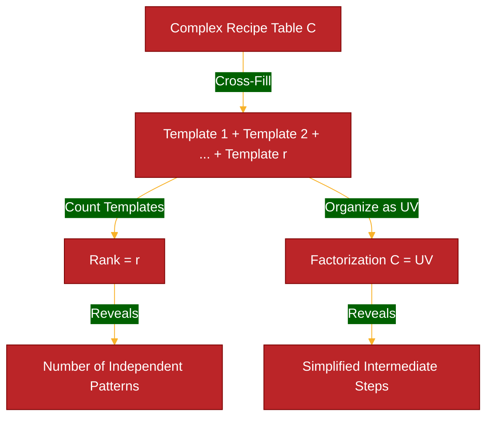

# Lecture 3: Cross-Filling Method

> **Topics**: §1.3 — Rank-One Decomposition, Cross-Filling Algorithm, Sum ↔ Product Equivalence
> **Date**: Mar 2–12, 2026

---

## Introduction

In Lecture 1, we discovered that every matrix product $AB$ can be written as a **sum of rank-one matrices**:

$$AB = \mathbf{a}_1 \mathbf{b}_1^T + \mathbf{a}_2 \mathbf{b}_2^T + \cdots + \mathbf{a}_n \mathbf{b}_n^T$$

This perspective was presented as "just another view" of matrix multiplication. **This week, we reverse the question**: Can we take an **arbitrary matrix $A$** and decompose it into rank-one pieces, even when it wasn't obtained as a product?

**The answer is yes**, and the algorithm for doing this is called **cross-filling** (also known as **rank-one peeling** or **outer product decomposition**). This is the **central computational technique** of the entire course.

---

## §1.3 The Cross-Filling Method

### Motivating Question: Reversing the Production Chain

Recall our coffee shop from Lecture 1. We have a direct recipe table from raw materials to final products:

$$C = \begin{array}{c|cc}
 & \text{Set 1 🍱} & \text{Set 2 🍜} \\
\hline
\text{Leaf 🍃} & 2 & 2 \\
\text{Lemon 🍋} & 1 & 1 \\
\text{Bean 🫘} & 0 & 4 \\
\text{Cow 🐄} & 2 & 1
\end{array} = \begin{pmatrix}
2 & 2 \\
1 & 1 \\
0 & 4 \\
2 & 1
\end{pmatrix}$$

**Question**: We know this came from composing two recipe tables $C = AB$, but what if we **forgot** what the intermediate products were? Can we **recover** the semi-finished products (🥛☕🍵) from just the direct recipe $C$?

**Why does this matter?** In real applications:
- We often observe the **final result** (matrix $C$) directly
- We don't know the **hidden intermediate steps** that produced it
- Finding the intermediate structure reveals **simplified recipes** and **redundancies**

This reverse engineering process is called **cross-filling** or **rank-one peeling**.

---

### A Simpler Example: The Coffee Stand

Let's start with an even simpler scenario to understand the core idea.

**Scenario**: A small coffee stand makes only 2 final products (🍱 Set 1, 🍜 Set 2) from 3 raw materials (🍃 Leaf, 🍋 Lemon, 🫘 Bean):

$$C = \begin{array}{c|cc}
 & \text{🍱} & \text{🍜} \\
\hline
\text{🍃} & 2 & 4 \\
\text{🍋} & 1 & 2 \\
\text{🫘} & 3 & 6
\end{array} = \begin{pmatrix}
2 & 4 \\
1 & 2 \\
3 & 6
\end{pmatrix}$$

**Observation**: Look at the two columns (the two meal sets):
- Set 1 (🍱): needs $(2\text{🍃}, 1\text{🍋}, 3\text{🫘})$
- Set 2 (🍜): needs $(4\text{🍃}, 2\text{🍋}, 6\text{🫘})$

**Notice**: Set 2 uses **exactly twice** as much of every ingredient as Set 1!

$$\text{🍜} = 2 \times \text{🍱}$$

This suggests there's really only **one basic recipe pattern**, and the two meal sets are just different portions of the same pattern.

**In other words**: The entire table $C$ can be built from a **single template**:

$$C = (\text{ingredient amounts}) \times (\text{portion sizes})$$

Let's make this precise.

---

### The Template: Rank-One Production

Define:
- **Recipe template** (ingredient column): $\mathbf{u} = \begin{pmatrix} 2 \\ 1 \\ 3 \end{pmatrix}$ for $(\text{🍃}, \text{🍋}, \text{🫘})$
- **Portion multipliers** (how much of template for each product): $\mathbf{v}^T = \begin{pmatrix} 1 & 2 \end{pmatrix}$ for $($ 🍱, 🍜 $)$

**Building the full table**:

For Set 1 (🍱): Use $1 \times$ the template:
$$\text{Set 1 amounts} = 1 \cdot \begin{pmatrix} 2 \\ 1 \\ 3 \end{pmatrix} = \begin{pmatrix} 2 \\ 1 \\ 3 \end{pmatrix}$$

For Set 2 (🍜): Use $2 \times$ the template:
$$\text{Set 2 amounts} = 2 \cdot \begin{pmatrix} 2 \\ 1 \\ 3 \end{pmatrix} = \begin{pmatrix} 4 \\ 2 \\ 6 \end{pmatrix}$$

**Combining columns**:
$$C = \begin{pmatrix}
| & | \\
1\mathbf{u} & 2\mathbf{u} \\
| & |
\end{pmatrix} = \begin{pmatrix} 2 & 4 \\ 1 & 2 \\ 3 & 6 \end{pmatrix}$$

**Matrix notation**:
$$C = \mathbf{u} \mathbf{v}^T = \begin{pmatrix} 2 \\ 1 \\ 3 \end{pmatrix} \begin{pmatrix} 1 & 2 \end{pmatrix}$$

Let's verify by multiplying out:
$$\mathbf{u} \mathbf{v}^T = \begin{pmatrix} 2 \\ 1 \\ 3 \end{pmatrix} \begin{pmatrix} 1 & 2 \end{pmatrix} = \begin{pmatrix}
2 \cdot 1 & 2 \cdot 2 \\
1 \cdot 1 & 1 \cdot 2 \\
3 \cdot 1 & 3 \cdot 2
\end{pmatrix} = \begin{pmatrix}
2 & 4 \\
1 & 2 \\
3 & 6
\end{pmatrix} \quad ✓$$

**Key insight**: Instead of storing 6 numbers (3 rows × 2 columns), we only need 5 numbers:
- 3 numbers in $\mathbf{u}$ (the template)
- 2 numbers in $\mathbf{v}^T$ (the multipliers)

This **factorization** $C = \mathbf{u} \mathbf{v}^T$ reveals the hidden structure: the recipe table has only **one independent pattern**.

::: remark
**Terminology: Rank-One Matrix**

A matrix that can be written as $\mathbf{u} \mathbf{v}^T$ (column vector times row vector) is called a **rank-one matrix**.

**Why "rank-one"?** Because it has only one independent pattern — all columns are multiples of the same template $\mathbf{u}$, and all rows are multiples of the same pattern $\mathbf{v}^T$.

**Visual property**: In a rank-one matrix, any four entries forming a rectangle satisfy:
$$c_{ij} \cdot c_{k\ell} = c_{i\ell} \cdot c_{kj}$$

For example: $c_{11} \cdot c_{22} = (2)(2) = 4 = (4)(1) = c_{12} \cdot c_{21}$ ✓

This is the **cross-filling property** — drawing a cross ✕ through any 2×2 submatrix, the diagonal products equal the anti-diagonal products.
:::

---

### What If the Table Isn't Rank-One?

Not all tables have this simple structure. Consider:

$$C = \begin{array}{c|cc}
 & \text{🍱} & \text{🍜} \\
\hline
\text{🍃} & 2 & 4 \\
\text{🍋} & 1 & 2 \\
\text{🫘} & 3 & 7
\end{array} = \begin{pmatrix}
2 & 4 \\
1 & 2 \\
3 & 7
\end{pmatrix}$$

**Check**: Is Set 2 a multiple of Set 1?
- $\frac{4}{2} = 2$ (🍃 ratio)
- $\frac{2}{1} = 2$ (🍋 ratio)
- $\frac{7}{3} = 2.33...$ (🫘 ratio) ← **Different!**

The ratios don't match, so this table **cannot** be written as $\mathbf{u} \mathbf{v}^T$.

**But here's the key idea**: We can **approximate** it as rank-one, then analyze the **remainder**.

---

### The Cross-Filling Algorithm: Peeling Off One Layer

**Strategy**: Build $C$ by adding simple (rank-one) pieces one at a time.

**Why is it called "十字填充法" (Cross-Filling)?**

The Chinese name reveals the visual pattern:
- **十字 (cross)**: We take a **cross-shaped slice** through the matrix
- **填充 (filling)**: We use this cross to **fill in** a rank-one pattern

Let's see how this works:

**Step 1**: Choose a **pivot** entry (any nonzero entry), say $c_{11} = 2$ (🍃 for 🍱)

**Step 2**: Extract the **cross** through this pivot:

```
Original matrix C:           The cross through pivot c₁₁:

┌─────────┐                  ┌─────────┐
│ 2   4  │                   │ ✕ → →  │  ← Row 1 (horizontal bar)
│ 1   2  │                   │ ↓      │
│ 3   7  │                   │ ↓      │  ← Column 1 (vertical bar)
└─────────┘                  └─────────┘
```

This gives us:
- **Row 1** (horizontal): $\begin{pmatrix} 2 & 4 \end{pmatrix}$ (🍃 usage: 2 for 🍱, 4 for 🍜)
- **Column 1** (vertical): $\begin{pmatrix} 2 \\ 1 \\ 3 \end{pmatrix}$ (ingredients for 🍱: 2🍃, 1🍋, 3🫘)

**Step 3**: Use **multiplication table principle** to fill other entries

**Key idea**: For any entry $(i,j)$ in the rank-one piece, compute:
$$R_{ij} = \frac{(\text{column entry at row } i) \times (\text{row entry at column } j)}{\text{pivot}}$$

In our example with pivot $c_{11} = 2$:

$$R_{ij} = \frac{(\text{Column 1})_i \times (\text{Row 1})_j}{c_{11}}$$

Let's compute:
- $R_{11} = \frac{2 \times 2}{2} = 2$ ✓ (matches pivot)
- $R_{12} = \frac{2 \times 4}{2} = 4$ ✓
- $R_{21} = \frac{1 \times 2}{2} = 1$ ✓
- $R_{22} = \frac{1 \times 4}{2} = 2$ ✓
- $R_{31} = \frac{3 \times 2}{2} = 3$ ✓
- $R_{32} = \frac{3 \times 4}{2} = 6$ ✓

**In matrix form** (factoring out $1/2$):

$$R_1 = \begin{pmatrix} 2 \\ 1 \\ 3 \end{pmatrix} \begin{pmatrix} 1 & 2 \end{pmatrix} = \begin{pmatrix}
\color{red}2 & \color{red}4 \\
\color{red}1 & \color{red}2 \\
\color{red}3 & \color{red}6
\end{pmatrix}$$

**This is the "filling" step**: We used the cross (one row + one column) to **fill in all entries** of a rank-one matrix!

**Step 4**: Compute the **remainder** (what's left after peeling off $R_1$):

$$C_2 = C - R_1 = \begin{pmatrix}
2 & 4 \\
1 & 2 \\
3 & 7
\end{pmatrix} - \begin{pmatrix}
2 & 4 \\
1 & 2 \\
3 & 6
\end{pmatrix} = \begin{pmatrix}
\color{blue}0 & \color{blue}0 \\
\color{blue}0 & \color{blue}0 \\
\color{blue}0 & \color{blue}1
\end{pmatrix}$$

**Observe**: Row 1 and column 1 are now **completely zero**! The rank-one piece "filled in" that cross-shaped region.

**Step 5**: The remainder $C_2$ is much simpler (only one nonzero entry). It's also rank-one:

$$C_2 = \begin{pmatrix} 0 \\ 0 \\ 1 \end{pmatrix} \begin{pmatrix} 0 & 1 \end{pmatrix} = \begin{pmatrix}
0 & 0 \\
0 & 0 \\
0 & 1
\end{pmatrix} = R_2$$

**Final result**:
$$C = R_1 + R_2 = \begin{pmatrix}
2 & 4 \\
1 & 2 \\
3 & 6
\end{pmatrix} + \begin{pmatrix}
0 & 0 \\
0 & 0 \\
0 & 1
\end{pmatrix} = \begin{pmatrix}
2 & 4 \\
1 & 2 \\
3 & 7
\end{pmatrix}$$

**Interpretation**: The coffee stand's recipe can be understood as:
- **Template 1** (main recipe): All products based on $(2\text{🍃}, 1\text{🍋}, 3\text{🫘})$ template, scaled by $(1, 2)$ for the two sets
- **Template 2** (extra beans): Set 2 needs an extra $1\text{🫘}$ beyond the main template

This reveals that the table has **two independent patterns** (rank = 2).

---

### Visual Interpretation: Why "Cross-Filling"?

The name comes from the two-step visual pattern:

**Step 1: Extract the CROSS** (十字)

```
Original matrix C:           Extract cross through c₁₁ = 2:

┌─────────┐                  ┌─────────┐
│ 2   4  │                   │ ═══════ │  ← Row 1 (horizontal bar)
│ 1   2  │          →        │ ║      │
│ 3   7  │                   │ ║      │  ← Column 1 (vertical bar)
└─────────┘                  └─────────┘
```

**Step 2: Use cross to FILL the matrix** (填充)

```
Multiplication table:        Result R₁:

     1   2  ← Row 1 ÷ pivot   ┌─────────┐
   ┌─────┐                    │ 2   4  │  = 2×(1,2)
 2 │ 2 4 │                    │ 1   2  │  = 1×(1,2)
 1 │ 1 2 │                    │ 3   6  │  = 3×(1,2)
 3 │ 3 6 │                    └─────────┘
   └─────┘
   ↑
Column 1
```

**Step 3: Subtract R₁ from C** (剥离)

```
C - R₁ = Remainder:

┌─────────┐     ┌─────────┐     ┌─────────┐
│ 2   4  │  -  │ 2   4  │  =  │ 0   0  │  ← Cross eliminated!
│ 1   2  │     │ 1   2  │     │ 0   0  │
│ 3   7  │     │ 3   6  │     │ 0   1  │
└─────────┘     └─────────┘     └─────────┘
```

**Key insight**:
- The **cross** (row + column through pivot) provides the template
- **Filling** creates entries via multiplication: $R_{ij} = \frac{\text{col}_i \times \text{row}_j}{\text{pivot}}$
- Subtracting $R_1$ **eliminates the cross region** (makes that row and column zero)

This is why it's called **十字填充法 (Cross-Filling Method)**!

---

## Motivation: Factoring Matrices

::: remark
**Analogy with factoring recipes**

- **Factoring numbers**: $12 = 3 \times 4$ (find simple components)
- **Factoring recipe tables**: $C = AB$ (find intermediate products that simplify production)

The key difference: We're not just finding **one** factorization — we want to decompose into a **sum of the simplest possible patterns** (rank-one pieces). This reveals how many truly independent recipes exist.
:::

**Our goal**: Given a recipe table (matrix) $C$, find:
1. **How many independent patterns** does it contain?
2. **What are those basic patterns** (rank-one templates)?
3. **Can we factor it** as $C = AB$ using simpler intermediate steps?

The **minimum number of patterns needed** is called the **rank** of the table.

---

### Abstract View: Rank-One Matrices

::: remark
**Change of Perspective**

In the previous sections, we used concrete coffee shop tables with emojis to understand **why** cross-filling works and **what** rank-one patterns mean.

**From this point forward**, we'll work with abstract matrices $A$, $B$, $R$ without referring back to coffee shops on every line. The logical principles remain the same:
- Rank-one = single template repeated with different multipliers
- Cross-filling = peeling off templates one at a time
- Rank = number of independent templates

This simplifies notation while preserving the deep understanding we've built.
:::

::: proposition
**Definition: Rank-One Matrix**

A matrix $R$ is **rank-one** if it can be written as:
$$R = \mathbf{u} \mathbf{v}^T$$
where $\mathbf{u}$ is an $m \times 1$ column vector (template) and $\mathbf{v}^T$ is a $1 \times n$ row vector (multipliers).
:::

::: example
**Example 2.1: Identifying rank-one structure**

Consider:
$$R = \begin{pmatrix}
6 & 9 & 3 \\
4 & 6 & 2 \\
10 & 15 & 5
\end{pmatrix}$$

**Check**: Are all rows multiples of the same pattern?
- Row 1: $(6, 9, 3) = 3 \cdot (2, 3, 1)$
- Row 2: $(4, 6, 2) = 2 \cdot (2, 3, 1)$
- Row 3: $(10, 15, 5) = 5 \cdot (2, 3, 1)$

Yes! All rows are multiples of $(2, 3, 1)$.

**Factorization**:
- Template: $\mathbf{u} = \begin{pmatrix} 3 \\ 2 \\ 5 \end{pmatrix}$ (row multipliers)
- Pattern: $\mathbf{v}^T = \begin{pmatrix} 2 & 3 & 1 \end{pmatrix}$ (column pattern)

$$R = \begin{pmatrix} 3 \\ 2 \\ 5 \end{pmatrix} \begin{pmatrix} 2 & 3 & 1 \end{pmatrix} = \mathbf{u} \mathbf{v}^T$$

**Verify**: $(3)(2, 3, 1) = (6, 9, 3)$ ✓, $(2)(2, 3, 1) = (4, 6, 2)$ ✓, $(5)(2, 3, 1) = (10, 15, 5)$ ✓
:::

::: attention
**Key property: Cross-product equality**

In a rank-one matrix $R = \mathbf{u} \mathbf{v}^T$:
$$r_{ij} = u_i v_j$$

This creates a special relationship: for ANY four entries forming a rectangle,
$$r_{11} \cdot r_{22} = r_{12} \cdot r_{21}$$

**Why?** Substitute the formula:
$$(u_1 v_1)(u_2 v_2) = (u_1 v_2)(u_2 v_1)$$
$$u_1 u_2 v_1 v_2 = u_1 u_2 v_2 v_1$$

Both sides equal the same thing!

**Visual mnemonic**: Draw a cross ✕ through any 2×2 block:
$$\begin{pmatrix}
\times & \times \\
\times & \times
\end{pmatrix}$$

Product of diagonal ✕ entries = Product of anti-diagonal entries. This is the **cross-filling property**, and it's where the method gets its name!
:::

---

### The Cross-Filling Algorithm

**Goal**: Decompose a matrix (recipe table) into rank-one pieces (basic templates).

**Why is this useful?**


```mermaid
---
config:
  theme: 'base'
  themeVariables:
    primaryColor: '#BB2528'
    primaryTextColor: '#fff'
    primaryBorderColor: '#7C0000'
    lineColor: '#F8B229'
    secondaryColor: '#006100'
    tertiaryColor: '#fff'
---
graph TD
    A[Complex Recipe Table C] -->|Cross-Fill| B[Template 1 + Template 2 + ... + Template r]
    B -->|Count Templates| C[Rank = r]
    B -->|Organize as UV| D[Factorization C = UV]
    C -->|Reveals| E[Number of Independent Patterns]
    D -->|Reveals| F[Simplified Intermediate Steps]
```

**Strategy**: **Peel off** rank-one matrices one at a time until nothing remains.

::: proposition
**Cross-Filling Algorithm (Rank-One Peeling)**

**Input**: Matrix $A$ (size $m \times n$)
**Output**: Rank-one decomposition $A = R_1 + R_2 + \cdots + R_r$

**Steps**:
1. Find a nonzero entry in $A$, say $a_{ij} \neq 0$ (the **pivot**)
2. Extract column $i$ and row $j$ to form:
   $$R_1 = \frac{1}{a_{ij}} \cdot (\text{column } i) \cdot (\text{row } j)$$
   This ensures $(R_1)_{ij} = a_{ij}$
3. Compute the **remainder**: $A_2 = A - R_1$
4. Observe: Row $i$ and column $j$ of $A_2$ are **zero**! (The rank-one piece "fills in" that cross)
5. Repeat with $A_2$ until the remainder is zero

**Termination**: The algorithm stops when all entries are eliminated. The number of iterations is the **rank** of $A$.
:::

Let's see this in action with a concrete example.

---

### Example: Cross-Filling Step-by-Step

::: example
**Example 2.2: Decomposing a 3×3 matrix**

Let's decompose:
$$A = \begin{pmatrix}
2 & 4 & 6 \\
1 & 2 & 3 \\
3 & 5 & 8
\end{pmatrix}$$

**Iteration 1**: Choose pivot $a_{11} = 2$ (top-left entry)

Extract column 1 and row 1:
- Column 1: $\mathbf{u}_1 = \begin{pmatrix} 2 \\ 1 \\ 3 \end{pmatrix}$
- Row 1: $\mathbf{v}_1^T = \begin{pmatrix} 2 & 4 & 6 \end{pmatrix}$

Form rank-one piece (normalized so pivot matches):
$$R_1 = \frac{1}{a_{11}} \mathbf{u}_1 \mathbf{v}_1^T = \frac{1}{2} \begin{pmatrix} 2 \\ 1 \\ 3 \end{pmatrix} \begin{pmatrix} 2 & 4 & 6 \end{pmatrix}$$

$$R_1 = \begin{pmatrix} 2 \\ 1 \\ 3 \end{pmatrix} \begin{pmatrix} 1 & 2 & 3 \end{pmatrix} = \begin{pmatrix}
\color{red}2 & \color{red}4 & \color{red}6 \\
\color{red}1 & \color{red}2 & \color{red}3 \\
\color{red}3 & \color{red}6 & \color{red}9
\end{pmatrix}$$

Compute remainder:
$$A_2 = A - R_1 = \begin{pmatrix}
2 & 4 & 6 \\
1 & 2 & 3 \\
3 & 5 & 8
\end{pmatrix} - \begin{pmatrix}
2 & 4 & 6 \\
1 & 2 & 3 \\
3 & 6 & 9
\end{pmatrix} = \begin{pmatrix}
\color{blue}0 & \color{blue}0 & \color{blue}0 \\
\color{blue}0 & 0 & 0 \\
\color{blue}0 & -1 & -1
\end{pmatrix}$$

Notice: **Row 1 and column 1 are now zero!** ✓

**Iteration 2**: Choose pivot $(A_2)_{23} = -1$ (or $(A_2)_{22}$ works too)

Extract column 2 and row 3 from $A_2$:
- Column 2: $\begin{pmatrix} 0 \\ 0 \\ -1 \end{pmatrix}$
- Row 3: $\begin{pmatrix} 0 & -1 & -1 \end{pmatrix}$

$$R_2 = \frac{1}{-1} \begin{pmatrix} 0 \\ 0 \\ -1 \end{pmatrix} \begin{pmatrix} 0 & -1 & -1 \end{pmatrix} = \begin{pmatrix}
0 & 0 & 0 \\
0 & 0 & 0 \\
0 & -1 & -1
\end{pmatrix}$$

Compute remainder:
$$A_3 = A_2 - R_2 = \begin{pmatrix}
0 & 0 & 0 \\
0 & 0 & 0 \\
0 & 0 & 0
\end{pmatrix}$$

**Done!** We have:
$$\boxed{A = R_1 + R_2}$$

The **rank of $A$ is 2** (we needed exactly 2 rank-one pieces).
:::

::: remark
**Why did row 1 and column 1 become zero?**

When we subtract $R_1 = \mathbf{u}_1 \mathbf{v}_1^T$ where $\mathbf{u}_1$ is column 1 and $\mathbf{v}_1^T$ is row 1 (scaled appropriately):
- Entry $(i, 1)$ gets subtracted by $(R_1)_{i1} = u_i v_1 = (\text{column 1})_i \cdot (\text{row 1})_1 / a_{11}$, which exactly matches $a_{i1}$
- Entry $(1, j)$ gets subtracted by $(R_1)_{1j} = u_1 v_j = (\text{column 1})_1 \cdot (\text{row 1})_j / a_{11}$, which exactly matches $a_{1j}$

The cross-shaped region defined by the pivot gets "filled in" and becomes zero!
:::

---

### Visual Interpretation: Cross-Filling Pattern

The name "cross-filling" comes from the visual pattern:

```
Original matrix A:      Choose pivot ✕:         After R₁ subtraction:

┌─────────┐            ┌─────────┐             ┌─────────┐
│ 2  4  6 │            │ ✕→ →  →│             │ 0  0  0 │
│ 1  2  3 │    →       │ ↓       │      →      │ 0  ?  ? │
│ 3  5  8 │            │ ↓       │             │ 0  ?  ? │
└─────────┘            └─────────┘             └─────────┘
```

The pivot position and its entire **row and column** (forming a cross ✕) are "filled in" (eliminated) by the rank-one piece.

**Insight**: This is why we call it "cross-filling" — each rank-one piece fills in one cross-shaped region!

---

## Sum ↔ Product Equivalence

The cross-filling algorithm gives us a **sum** of rank-one matrices:
$$A = R_1 + R_2 + \cdots + R_r$$

where $R_k = \mathbf{u}_k \mathbf{v}_k^T$.

But we can also write this as a **product**. Before showing how, let's clarify an important distinction in vector multiplication.

---

### Inner Product vs. Outer Product: Two Ways to Multiply Vectors

When we multiply vectors, the **order of dimensions** matters critically.

::: definition
**Two Products of Vectors**

Given column vectors $\mathbf{u} \in \mathbb{R}^m$ and $\mathbf{v} \in \mathbb{R}^n$:

**1. Inner product** (row × column): $\mathbf{u}^T \mathbf{v}$ produces a **scalar**

$$\mathbf{u}^T \mathbf{v} = \begin{pmatrix} u_1 & u_2 & \cdots & u_m \end{pmatrix} \begin{pmatrix} v_1 \\ v_2 \\ \vdots \\ v_m \end{pmatrix} = u_1 v_1 + u_2 v_2 + \cdots + u_m v_m$$

- **Dimensions**: $(1 \times m)(m \times 1) = 1 \times 1$ → **single number**
- **Geometric meaning**: Measures "alignment" or "projection" between vectors
- **Common name**: Dot product

**2. Outer product** (column × row): $\mathbf{u} \mathbf{v}^T$ produces a **matrix**

$$\mathbf{u} \mathbf{v}^T = \begin{pmatrix} u_1 \\ u_2 \\ \vdots \\ u_m \end{pmatrix} \begin{pmatrix} v_1 & v_2 & \cdots & v_n \end{pmatrix} = \begin{pmatrix}
u_1 v_1 & u_1 v_2 & \cdots & u_1 v_n \\
u_2 v_1 & u_2 v_2 & \cdots & u_2 v_n \\
\vdots & \vdots & \ddots & \vdots \\
u_m v_1 & u_m v_2 & \cdots & u_m v_n
\end{pmatrix}$$

- **Dimensions**: $(m \times 1)(1 \times n) = m \times n$ → **matrix**
- **Structure**: Every row is a multiple of $\mathbf{v}^T$; every column is a multiple of $\mathbf{u}$
- **Result**: A **rank-one matrix** (exactly what we've been building!)
:::

::: example
**Example: Inner vs. Outer Product**

Let $\mathbf{u} = \begin{pmatrix} 2 \\ 1 \end{pmatrix}$ and $\mathbf{v} = \begin{pmatrix} 3 \\ 4 \end{pmatrix}$.

**Inner product** (row × column):
$$\mathbf{u}^T \mathbf{v} = \begin{pmatrix} 2 & 1 \end{pmatrix} \begin{pmatrix} 3 \\ 4 \end{pmatrix} = 2(3) + 1(4) = 10$$

Result: A single number.

**Outer product** (column × row):
$$\mathbf{u} \mathbf{v}^T = \begin{pmatrix} 2 \\ 1 \end{pmatrix} \begin{pmatrix} 3 & 4 \end{pmatrix} = \begin{pmatrix}
2 \cdot 3 & 2 \cdot 4 \\
1 \cdot 3 & 1 \cdot 4
\end{pmatrix} = \begin{pmatrix}
6 & 8 \\
3 & 4
\end{pmatrix}$$

Result: A $2 \times 2$ rank-one matrix.

Notice: Row 2 = $\frac{1}{2}$ × Row 1, Column 2 = $\frac{4}{3}$ × Column 1. This is the rank-one pattern!
:::

::: remark
**Why "inner" and "outer"?**

The terminology comes from tensor analysis:
- **Inner product** $\mathbf{u}^T \mathbf{v}$: The indices "contract" (sum over), reducing dimensions → smaller object (scalar)
- **Outer product** $\mathbf{u} \mathbf{v}^T$: The indices "expand" (create grid), increasing dimensions → larger object (matrix)

**Key for this course**: All our rank-one matrices $R_k = \mathbf{u}_k \mathbf{v}_k^T$ are **outer products**, not inner products!
:::

---

### Converting Sum to Product: The Inner Dimension

Now we can convert between sum and product forms.

::: proposition
**Sum ↔ Product Equivalence**

$$A = \sum_{k=1}^r \mathbf{u}_k \mathbf{v}_k^T \quad \Longleftrightarrow \quad A = UV$$

where:
- $U = \begin{pmatrix} | & | & & | \\ \mathbf{u}_1 & \mathbf{u}_2 & \cdots & \mathbf{u}_r \\ | & | & & | \end{pmatrix}$ (columns are the $\mathbf{u}_k$)

- $V = \begin{pmatrix} - & \mathbf{v}_1^T & - \\ - & \mathbf{v}_2^T & - \\ & \vdots & \\ - & \mathbf{v}_r^T & - \end{pmatrix}$ (rows are the $\mathbf{v}_k^T$)
:::

**Why are these equivalent?**

Recall from Lecture 1, Perspective 3 (sum-of-rank-one view):
$$UV = \sum_{k=1}^r \mathbf{u}_k \mathbf{v}_k^T$$

where $\mathbf{u}_k$ is column $k$ of $U$ and $\mathbf{v}_k^T$ is row $k$ of $V$.

---

### The Inner Dimension: Where Rank Lives

Notice something special about the dimensions in $A = UV$:

::: definition
**Inner Dimension of a Matrix Product**

When we write a matrix product $C = AB$ where:
- $A$ is $m \times r$ (m rows, r columns)
- $B$ is $r \times n$ (r rows, n columns)
- $C$ is $m \times n$

The dimension $r$ is called the **inner dimension** of the product — it's the "common dimension" that appears in the middle:

$$C_{m \times n} = A_{m \times \boxed{r}} \cdot B_{\boxed{r} \times n}$$

**Visual pattern**:
```
   outer dimension (m)
        ↓
    [  m × r  ] · [  r × n  ]  =  [  m × n  ]
            ↑          ↑                ↑
      inner dimension (r)      outer dimension (n)
        (must match!)
```

The inner dimension must match for matrix multiplication to be valid.
:::

::: remark
**Rank appears as the inner dimension**

When we factor $A = UV$ using cross-filling:
$$A_{m \times n} = U_{m \times r} \cdot V_{r \times n}$$

The **rank** of $A$ appears as the **inner dimension** $r$ of this factorization!

**Why is this profound?**
- The **outer dimensions** $(m, n)$ are obvious — they're the size of the original matrix $A$
- The **inner dimension** $r$ is **hidden** — it reveals the number of independent patterns inside $A$
- Cross-filling **discovers** this hidden dimension by peeling off rank-one layers

**Terminology connection**:
- Inner **product** $\mathbf{u}^T \mathbf{v}$: vectors contract (reduce dimension)
- Inner **dimension** $r$ in $A = UV$: the hidden structural complexity
- Both are "inner" because they're not immediately visible from the outside!
:::

---

---

::: example
**Example 2.3: Converting sum to product form**

From Example 2.2, we found:
$$A = R_1 + R_2$$

where:
$$R_1 = \begin{pmatrix} 2 \\ 1 \\ 3 \end{pmatrix} \begin{pmatrix} 1 & 2 & 3 \end{pmatrix}, \quad
R_2 = \begin{pmatrix} 0 \\ 0 \\ -1 \end{pmatrix} \begin{pmatrix} 0 & -1 & -1 \end{pmatrix}$$

**Extracting vectors**:
- $\mathbf{u}_1 = \begin{pmatrix} 2 \\ 1 \\ 3 \end{pmatrix}$, $\mathbf{v}_1^T = \begin{pmatrix} 1 & 2 & 3 \end{pmatrix}$
- $\mathbf{u}_2 = \begin{pmatrix} 0 \\ 0 \\ -1 \end{pmatrix}$, $\mathbf{v}_2^T = \begin{pmatrix} 0 & -1 & -1 \end{pmatrix}$

**Form matrices $U$ and $V$**:
$$U = \begin{pmatrix}
| & | \\
\mathbf{u}_1 & \mathbf{u}_2 \\
| & |
\end{pmatrix} = \begin{pmatrix}
2 & 0 \\
1 & 0 \\
3 & -1
\end{pmatrix}, \quad
V = \begin{pmatrix}
- & \mathbf{v}_1^T & - \\
- & \mathbf{v}_2^T & -
\end{pmatrix} = \begin{pmatrix}
1 & 2 & 3 \\
0 & -1 & -1
\end{pmatrix}$$

**Verify**:
$$UV = \begin{pmatrix}
2 & 0 \\
1 & 0 \\
3 & -1
\end{pmatrix} \begin{pmatrix}
1 & 2 & 3 \\
0 & -1 & -1
\end{pmatrix} = \begin{pmatrix}
2 & 4 & 6 \\
1 & 2 & 3 \\
3 & 5 & 8
\end{pmatrix} = A \quad ✓$$

So we have factored $A$ as:
$$A_{3 \times 3} = U_{3 \times 2} \cdot V_{2 \times 3}$$

The rank of $A$ is 2, which appears as the **inner dimension** of the factorization (as defined earlier)!
:::

::: remark
**Data compression via low-rank factorization**

For an $m \times n$ matrix $A$ of rank $r$:
$$A = U_{m \times r} \cdot V_{r \times n}$$

The factorization is **dimension-reducing**: instead of storing $mn$ entries of $A$, we can store:
- $mr$ entries of $U$
- $rn$ entries of $V$
- **Total**: $mr + rn = (m+n)r$ entries

**When is this beneficial?** When $r \ll \min(m,n)$ (rank is much smaller than matrix dimensions).

**Example**: A $1000 \times 1000$ matrix of rank 5:
- Direct storage: $10^6$ entries
- Factored storage: $(1000 + 1000) \times 5 = 10{,}000$ entries
- **Compression ratio**: $100:1$!

This is the basis for **low-rank approximation** methods used in data science, image compression, and recommendation systems.
:::

---

## Rank and Its Properties

::: definition
**Definition: Rank of a Matrix**

The **rank** of a matrix $A$, denoted $\operatorname{rank}(A)$ or $\rho(A)$, is the **number of rank-one matrices produced by the cross-filling algorithm**:
$$A = R_1 + R_2 + \cdots + R_r$$

Equivalently, the rank is the **inner dimension** $r$ in the factorization $A_{m \times n} = U_{m \times r} V_{r \times n}$ obtained from cross-filling.

This is a **structural invariant** of the matrix — it counts how many independent patterns the matrix contains.
:::

::: warning
**Is this definition well-defined?**

We've defined rank based on the **cross-filling algorithm**, but there's a subtle issue: cross-filling allows **different pivot choices** at each step.

**Question**: Do different pivot choices always give the **same number** of rank-one pieces?

**Answer preview**: Yes! But we don't know this yet. We'll prove in **Lecture 4** that rank is **well-defined** (independent of pivot choices) by connecting it to a geometric property called **dimension of the column space**.

For now, we'll use cross-filling to compute ranks, understanding that the well-definedness is a theorem we'll prove soon.
:::

**Immediate consequences** from the cross-filling algorithm:

::: proposition
**Basic properties of rank**

1. **Non-negativity**: $\operatorname{rank}(A) \geq 0$ for any matrix $A$
   - If $A = O$ (zero matrix), then $\operatorname{rank}(A) = 0$

2. **Upper bound**: $\operatorname{rank}(A) \leq \min(m, n)$ for an $m \times n$ matrix $A$
   - You can't peel off more rank-one pieces than there are rows or columns

3. **Full rank**: If $\operatorname{rank}(A) = \min(m, n)$, we say $A$ has **full rank**
   - For a square $n \times n$ matrix, full rank means $\operatorname{rank}(A) = n$

4. **Rank and zero rows/columns**: Each cross-filling iteration eliminates one row and one column
   - After $r$ iterations, at least $r$ rows and $r$ columns are linearly dependent on earlier ones
:::

::: example
**Example 2.4: Ranks of familiar matrices**

**Identity matrix**:
$$I_3 = \begin{pmatrix}
1 & 0 & 0 \\
0 & 1 & 0 \\
0 & 0 & 1
\end{pmatrix} = \begin{pmatrix} 1 \\ 0 \\ 0 \end{pmatrix} \begin{pmatrix} 1 & 0 & 0 \end{pmatrix} + \begin{pmatrix} 0 \\ 1 \\ 0 \end{pmatrix} \begin{pmatrix} 0 & 1 & 0 \end{pmatrix} + \begin{pmatrix} 0 \\ 0 \\ 1 \end{pmatrix} \begin{pmatrix} 0 & 0 & 1 \end{pmatrix}$$

Needs 3 rank-one pieces → $\operatorname{rank}(I_3) = 3$ (full rank)

**Any rank-one matrix**: $\operatorname{rank}(\mathbf{u} \mathbf{v}^T) = 1$ (by definition, assuming $\mathbf{u}, \mathbf{v} \neq \mathbf{0}$)

**Zero matrix**: $\operatorname{rank}(O) = 0$
:::

---

## Application 1: LU Decomposition via Diagonal Cross-Filling

The cross-filling method is highly flexible — different pivot choices lead to different factorizations. One particularly important variant is **diagonal cross-filling**, which produces the famous **LU decomposition** used throughout numerical linear algebra.

### What is LU Decomposition?

::: definition
**LU Decomposition**

An **LU decomposition** of a matrix $A$ is a factorization:
$$A = LU$$
where:
- $L$ is **lower triangular** with 1's on the diagonal (called **unit lower triangular**)
- $U$ is **upper triangular**

**Example**:
$$\begin{pmatrix}
4 & 3 & 2 \\
8 & 9 & 6 \\
12 & 9 & 14
\end{pmatrix} = \begin{pmatrix}
1 & 0 & 0 \\
2 & 1 & 0 \\
3 & 0 & 1
\end{pmatrix} \begin{pmatrix}
4 & 3 & 2 \\
0 & 3 & 2 \\
0 & 0 & 8
\end{pmatrix}$$

This is the factorization used by MATLAB, NumPy, and most linear algebra software to solve $Ax = b$ efficiently.
:::

**Connection to cross-filling**: LU decomposition is obtained by always choosing **diagonal pivots** in cross-filling, proceeding from top-left to bottom-right.

---

### Diagonal Cross-Filling: The Strategy

Instead of arbitrary pivot choices, we follow a systematic pattern:

::: proposition
**Diagonal Cross-Filling Algorithm**

**Strategy**: Always choose the **next diagonal entry** as pivot, proceeding along the diagonal from $(1,1)$ to $(n,n)$.

**Steps**:
1. **Iteration $k$**: Choose pivot $a_{kk}$ (the $k$-th diagonal entry of the current remainder matrix)
2. Extract the **diagonal cross**:
   - Column $k$ from row $k$ downward: $\begin{pmatrix} a_{kk} \\ a_{k+1,k} \\ \vdots \\ a_{n,k} \end{pmatrix}$
   - Row $k$ from column $k$ rightward: $\begin{pmatrix} a_{kk} & a_{k,k+1} & \cdots & a_{k,n} \end{pmatrix}$
3. Form rank-one piece (normalized by pivot):
   $$R_k = \frac{1}{a_{kk}} \cdot (\text{column } k) \cdot (\text{row } k)$$
4. Compute remainder: $A_{k+1} = A_k - R_k$
   - This zeros out row $k$ (from column $k+1$ onward) and column $k$ (from row $k+1$ onward)
5. Repeat for $k = 1, 2, \ldots, n$

**Result**: $A = R_1 + R_2 + \cdots + R_n$ where each $R_k$ is a rank-one matrix.

We can reorganize this sum as $A = LU$ by proper bookkeeping (explained below).
:::

::: remark
**Why diagonal pivots?**

Choosing diagonal pivots creates a special structure:
- **After iteration $k$**: Rows $1, \ldots, k$ and columns $1, \ldots, k$ are "processed"
- **Remainder $A_{k+1}$**: Only the bottom-right block $A[k+1:n, k+1:n]$ remains nonzero
- **Triangular pattern emerges**: This systematic elimination naturally produces triangular matrices $L$ and $U$

This is exactly how **Gaussian elimination** works — it's the same algorithm, viewed through the outer product lens!
:::

---

### Example: LU via Diagonal Cross-Filling

::: example
**Example 2.6: 3×3 LU Decomposition**

Decompose:
$$A = \begin{pmatrix}
4 & 3 & 2 \\
8 & 9 & 6 \\
12 & 9 & 14
\end{pmatrix}$$

**Iteration 1**: Pivot $a_{11} = 4$

Extract diagonal cross:
- Column 1 (from row 1 down): $\mathbf{u}_1 = \begin{pmatrix} 4 \\ 8 \\ 12 \end{pmatrix}$
- Row 1 (from column 1 right): $\mathbf{v}_1^T = \begin{pmatrix} 4 & 3 & 2 \end{pmatrix}$

Normalize by pivot $a_{11} = 4$:
$$R_1 = \begin{pmatrix} 4 \\ 8 \\ 12 \end{pmatrix} \begin{pmatrix} 1 & 0.75 & 0.5 \end{pmatrix} = \begin{pmatrix}
4 & 3 & 2 \\
8 & 6 & 4 \\
12 & 9 & 6
\end{pmatrix}$$

Compute remainder:
$$A_2 = A - R_1 = \begin{pmatrix}
4 & 3 & 2 \\
8 & 9 & 6 \\
12 & 9 & 14
\end{pmatrix} - \begin{pmatrix}
4 & 3 & 2 \\
8 & 6 & 4 \\
12 & 9 & 6
\end{pmatrix} = \begin{pmatrix}
\color{blue}0 & \color{blue}0 & \color{blue}0 \\
\color{blue}0 & 3 & 2 \\
\color{blue}0 & 0 & 8
\end{pmatrix}$$

**Notice**: Row 1 and column 1 are now **completely zero**! ✓

**Iteration 2**: Pivot $(A_2)_{22} = 3$

Extract diagonal cross from $A_2$:
- Column 2 (from row 2 down): $\mathbf{u}_2 = \begin{pmatrix} 0 \\ 3 \\ 0 \end{pmatrix}$
- Row 2 (from column 2 right): $\mathbf{v}_2^T = \begin{pmatrix} 0 & 3 & 2 \end{pmatrix}$

Normalize by pivot 3:
$$R_2 = \begin{pmatrix} 0 \\ 3 \\ 0 \end{pmatrix} \begin{pmatrix} 0 & 1 & \frac{2}{3} \end{pmatrix} = \begin{pmatrix}
0 & 0 & 0 \\
0 & 3 & 2 \\
0 & 0 & 0
\end{pmatrix}$$

Compute remainder:
$$A_3 = A_2 - R_2 = \begin{pmatrix}
0 & 0 & 0 \\
0 & 3 & 2 \\
0 & 0 & 8
\end{pmatrix} - \begin{pmatrix}
0 & 0 & 0 \\
0 & 3 & 2 \\
0 & 0 & 0
\end{pmatrix} = \begin{pmatrix}
0 & 0 & 0 \\
\color{blue}0 & \color{blue}0 & \color{blue}0 \\
0 & \color{blue}0 & 8
\end{pmatrix}$$

**Iteration 3**: Pivot $(A_3)_{33} = 8$

$$R_3 = \begin{pmatrix} 0 \\ 0 \\ 8 \end{pmatrix} \begin{pmatrix} 0 & 0 & 1 \end{pmatrix} = \begin{pmatrix}
0 & 0 & 0 \\
0 & 0 & 0 \\
0 & 0 & 8
\end{pmatrix}$$

**Done!** We have:
$$A = R_1 + R_2 + R_3$$

Now we need to convert this to $LU$ form.
:::

---

### Converting to LU Form: Normalizing the Outer Products

The rank-one pieces $R_k$ from diagonal cross-filling contain all the information for $L$ and $U$, but they need to be reorganized.

**Key idea**: Each $R_k = \mathbf{u}_k \mathbf{v}_k^T$ contributes:
- To $L$: The column multipliers (how each row is scaled)
- To $U$: The row pattern (what gets added to each row)

::: proposition
**From Diagonal Cross-Filling to LU**

If we perform diagonal cross-filling with pivots $a_{11}, a_{22}, \ldots, a_{nn}$, obtaining:
$$A = \sum_{k=1}^n \mathbf{u}_k \mathbf{v}_k^T$$

We can extract $L$ and $U$ as follows:

**Building $U$** (upper triangular):
- Row $k$ of $U$ = $\mathbf{v}_k^T$ (the row vector extracted at iteration $k$)
$$U = \begin{pmatrix}
- & \mathbf{v}_1^T & - \\
- & \mathbf{v}_2^T & - \\
& \vdots & \\
- & \mathbf{v}_n^T & -
\end{pmatrix}$$

**Building $L$** (unit lower triangular):
- Column $k$ of $L$ = $\mathbf{u}_k / (\mathbf{u}_k)_k$ (normalize so diagonal = 1)
$$L = \begin{pmatrix}
| & | & & | \\
\frac{\mathbf{u}_1}{u_{11}} & \frac{\mathbf{u}_2}{u_{22}} & \cdots & \frac{\mathbf{u}_n}{u_{nn}} \\
| & | & & |
\end{pmatrix}$$

where $(\mathbf{u}_k)_k$ denotes the $k$-th entry of vector $\mathbf{u}_k$ (which equals the pivot $a_{kk}$).
:::

::: remark
**Why normalize by the diagonal?**

When we extract column $k$ at iteration $k$, it has the form:
$$\mathbf{u}_k = \begin{pmatrix} 0 \\ \vdots \\ 0 \\ a_{kk} \\ a_{k+1,k} \\ \vdots \\ a_{n,k} \end{pmatrix} \leftarrow \begin{matrix} \text{entries 1 through } k-1 \\ \text{are zero (already processed)} \\ \\ \text{entry } k \text{ is the pivot} \\ \\ \text{entries } k+1 \text{ through } n \end{matrix}$$

To make $L$ **unit lower triangular** (diagonal = 1), we must normalize:
$$\text{Column } k \text{ of } L = \frac{\mathbf{u}_k}{a_{kk}} = \begin{pmatrix} 0 \\ \vdots \\ 0 \\ 1 \\ a_{k+1,k}/a_{kk} \\ \vdots \\ a_{n,k}/a_{kk} \end{pmatrix}$$

Now the diagonal entry is exactly 1! ✓

**Where did the pivot go?** It gets absorbed into $U$: row $k$ of $U$ is $\mathbf{v}_k^T$, which starts with the pivot $a_{kk}$ in position $(k,k)$.

**Outer product reconstruction**: When we compute $LU$, we get:
$$LU = \sum_{k=1}^n (\text{column } k \text{ of } L) \cdot (\text{row } k \text{ of } U) = \sum_{k=1}^n \frac{\mathbf{u}_k}{a_{kk}} \cdot \mathbf{v}_k^T$$

But $\mathbf{v}_k^T$ was already normalized by $a_{kk}$ during cross-filling! So this reconstructs $R_k$ exactly.
:::

---

### Example Continued: Extracting $L$ and $U$

::: example
**Example 2.6 (continued): Building $L$ and $U$**

From our diagonal cross-filling:

**Iteration 1** gave:
- $\mathbf{u}_1 = \begin{pmatrix} 4 \\ 8 \\ 12 \end{pmatrix}$, $\mathbf{v}_1^T = \begin{pmatrix} 4 & 3 & 2 \end{pmatrix}$
- Pivot: $a_{11} = 4$
- Normalized column: $\frac{\mathbf{u}_1}{4} = \begin{pmatrix} 1 \\ 2 \\ 3 \end{pmatrix}$

**Iteration 2** gave:
- $\mathbf{u}_2 = \begin{pmatrix} 0 \\ 3 \\ 0 \end{pmatrix}$, $\mathbf{v}_2^T = \begin{pmatrix} 0 & 3 & 2 \end{pmatrix}$
- Pivot: $a_{22} = 3$
- Normalized column: $\frac{\mathbf{u}_2}{3} = \begin{pmatrix} 0 \\ 1 \\ 0 \end{pmatrix}$

**Iteration 3** gave:
- $\mathbf{u}_3 = \begin{pmatrix} 0 \\ 0 \\ 8 \end{pmatrix}$, $\mathbf{v}_3^T = \begin{pmatrix} 0 & 0 & 8 \end{pmatrix}$
- Pivot: $a_{33} = 8$
- Normalized column: $\frac{\mathbf{u}_3}{8} = \begin{pmatrix} 0 \\ 0 \\ 1 \end{pmatrix}$

**Assemble $L$** (columns are normalized $\mathbf{u}_k$):
$$L = \begin{pmatrix}
1 & 0 & 0 \\
2 & 1 & 0 \\
3 & 0 & 1
\end{pmatrix}$$

**Assemble $U$** (rows are $\mathbf{v}_k^T$):
$$U = \begin{pmatrix}
4 & 3 & 2 \\
0 & 3 & 2 \\
0 & 0 & 8
\end{pmatrix}$$

**Verify** $LU = A$:
$$LU = \begin{pmatrix}
1 & 0 & 0 \\
2 & 1 & 0 \\
3 & 0 & 1
\end{pmatrix} \begin{pmatrix}
4 & 3 & 2 \\
0 & 3 & 2 \\
0 & 0 & 8
\end{pmatrix}$$

Using outer product expansion:
$$LU = \begin{pmatrix} 1 \\ 2 \\ 3 \end{pmatrix} \begin{pmatrix} 4 & 3 & 2 \end{pmatrix} + \begin{pmatrix} 0 \\ 1 \\ 0 \end{pmatrix} \begin{pmatrix} 0 & 3 & 2 \end{pmatrix} + \begin{pmatrix} 0 \\ 0 \\ 1 \end{pmatrix} \begin{pmatrix} 0 & 0 & 8 \end{pmatrix}$$

$$= \begin{pmatrix}
4 & 3 & 2 \\
8 & 6 & 4 \\
12 & 9 & 6
\end{pmatrix} + \begin{pmatrix}
0 & 0 & 0 \\
0 & 3 & 2 \\
0 & 0 & 0
\end{pmatrix} + \begin{pmatrix}
0 & 0 & 0 \\
0 & 0 & 0 \\
0 & 0 & 8
\end{pmatrix} = \begin{pmatrix}
4 & 3 & 2 \\
8 & 9 & 6 \\
12 & 9 & 14
\end{pmatrix} = A \quad ✓$$

Perfect! This is exactly $R_1 + R_2 + R_3$ from our cross-filling.
:::

---

### When Does LU Decomposition Exist?

Not all matrices have an LU decomposition (without row swaps).

::: remark
**Existence Condition for LU Decomposition**

LU decomposition (without row permutations) exists if and only if all **leading principal minors** of $A$ are nonzero:
$$\det(A[1:k, 1:k]) \neq 0 \quad \text{for } k = 1, 2, \ldots, n$$

**Why?** Because we need each diagonal pivot $a_{kk}$ (in the remainder matrix at step $k$) to be nonzero.

**Example of failure**:
$$A = \begin{pmatrix}
0 & 1 \\
1 & 1
\end{pmatrix}$$

Diagonal cross-filling fails immediately at $a_{11} = 0$ (can't use as pivot).

**Solution**: Use **row permutations** (row swaps) to move a nonzero entry to the diagonal. This leads to **PLU decomposition**:
$$PA = LU$$
where $P$ is a **permutation matrix** (represents row swaps).

**Every** invertible matrix has a PLU decomposition! This is what MATLAB/NumPy actually compute.
:::

---

### Summary: LU as Structured Cross-Filling

**Key insights**:

1. **LU decomposition = diagonal cross-filling**: Always choose diagonal entries as pivots, proceeding top-left to bottom-right

2. **Normalization creates unit lower triangular $L$**: Divide each column vector $\mathbf{u}_k$ by its pivot entry to make $L$'s diagonal equal 1

3. **$U$ stores the row information**: Each row of $U$ is the row vector $\mathbf{v}_k^T$ extracted at step $k$, which naturally has upper triangular form (zeros in columns $1$ through $k-1$)

4. **Outer product perspective**:
   $$A = LU = \sum_{k=1}^n (\text{column } k \text{ of } L) \cdot (\text{row } k \text{ of } U)$$

   Each term is a rank-one outer product $\mathbf{u}_k \mathbf{v}_k^T$ contributing to the full matrix!

5. **Connection to Gaussian elimination**: This is **exactly** the same algorithm as Gaussian elimination, but viewed through the lens of outer products rather than row operations. The outer product view reveals **why** Gaussian elimination works and **what structure** it creates.

This perspective transforms LU from "a mysterious factorization" to "a natural consequence of systematic rank-one peeling."

---

## Application 2: Solving $Ax = b$ via Cross-Filling

Now we can use cross-filling to solve linear systems! The idea: if we know $A = UV$, then solving $Ax = b$ becomes easier.

::: proposition
**Solving $Ax = b$ using factorization $A = UV$**

If $A = UV$, then $Ax = b$ becomes:
$$UVx = b$$

**Strategy**:
1. Solve $Uy = b$ for $y$ (often easier if $U$ has special structure)
2. Solve $Vx = y$ for $x$

**When does this help?** When $U$ and $V$ have simpler structure than $A$ (e.g., fewer columns/rows, triangular form).
:::

::: example
**Example 2.5: Solving a system using cross-filling factorization**

Solve:
$$\begin{pmatrix}
2 & 4 & 6 \\
1 & 2 & 3 \\
3 & 5 & 8
\end{pmatrix} \begin{pmatrix} x_1 \\ x_2 \\ x_3 \end{pmatrix} = \begin{pmatrix} 8 \\ 4 \\ 11 \end{pmatrix}$$

From Example 2.3, we know:
$$A = UV = \begin{pmatrix}
2 & 0 \\
1 & 0 \\
3 & -1
\end{pmatrix} \begin{pmatrix}
1 & 2 & 3 \\
0 & -1 & -1
\end{pmatrix}$$

**Step 1**: Solve $Uy = b$ where $b = \begin{pmatrix} 8 \\ 4 \\ 11 \end{pmatrix}$

$$\begin{pmatrix}
2 & 0 \\
1 & 0 \\
3 & -1
\end{pmatrix} \begin{pmatrix} y_1 \\ y_2 \end{pmatrix} = \begin{pmatrix} 8 \\ 4 \\ 11 \end{pmatrix}$$

From row 1: $2y_1 = 8$ → $y_1 = 4$
From row 2: $y_1 = 4$ → ✓ (consistent)
From row 3: $3y_1 - y_2 = 11$ → $12 - y_2 = 11$ → $y_2 = 1$

So $y = \begin{pmatrix} 4 \\ 1 \end{pmatrix}$

**Step 2**: Solve $Vx = y$ where $y = \begin{pmatrix} 4 \\ 1 \end{pmatrix}$

$$\begin{pmatrix}
1 & 2 & 3 \\
0 & -1 & -1
\end{pmatrix} \begin{pmatrix} x_1 \\ x_2 \\ x_3 \end{pmatrix} = \begin{pmatrix} 4 \\ 1 \end{pmatrix}$$

From row 2: $-x_2 - x_3 = 1$ → $x_2 = -1 - x_3$ (one free parameter!)

From row 1: $x_1 + 2x_2 + 3x_3 = 4$
$$x_1 + 2(-1 - x_3) + 3x_3 = 4$$
$$x_1 - 2 - 2x_3 + 3x_3 = 4$$
$$x_1 = 6 - x_3$$

**General solution** (parameterized by $t = x_3$):
$$\boxed{x = \begin{pmatrix} 6 - t \\ -1 - t \\ t \end{pmatrix} = \begin{pmatrix} 6 \\ -1 \\ 0 \end{pmatrix} + t \begin{pmatrix} -1 \\ -1 \\ 1 \end{pmatrix}}$$

This shows the system has **infinitely many solutions** (because $\operatorname{rank}(A) = 2 < 3$).
:::

::: remark
**The solvability condition emerges**

Notice in Example 2.5:
- The system $Uy = b$ had 3 equations in 2 unknowns, but it was still solvable!
- This happened because $b$ satisfied a constraint: row 2 of $U$ equals row 1, so $b_2$ must equal $b_1/2$

**General principle** (to be formalized in Week 3):
- $Ax = b$ is solvable ⟺ $b$ lies in the **column space** of $A$ (the space spanned by columns of $A$)
- Cross-filling reveals this structure by reducing $A = UV$ to simpler matrices
:::

---

## Uniqueness of Cross-Filling

::: attention
**Is the rank-one decomposition unique?**

**Answer**: The decomposition $A = R_1 + R_2 + \cdots + R_r$ is **NOT unique**!

**Why?** Different pivot choices lead to different decompositions.

**Example**: For $A = \begin{pmatrix} 2 & 4 \\ 1 & 2 \end{pmatrix}$

**Choice 1** (pivot $a_{11} = 2$):
$$A = \begin{pmatrix} 2 \\ 1 \end{pmatrix} \begin{pmatrix} 1 & 2 \end{pmatrix}$$

**Choice 2** (pivot $a_{22} = 2$):
$$A = \begin{pmatrix} 2 & 4 \\ 1 & 2 \end{pmatrix} = \begin{pmatrix} 1 \\ 0.5 \end{pmatrix} \begin{pmatrix} 2 & 4 \end{pmatrix}$$

Both are valid! They give different $U$ and $V$ matrices, but the same rank (r=1).

**What IS unique?** The **rank** $r$ is always the same regardless of pivot choices. We'll prove this in **Lecture 4** by showing that rank equals the **dimension of the column space**, a geometric property independent of algorithm choices.
:::

---

## Summary: The Power of Cross-Filling

In this lecture, we developed the **cross-filling method**, which reveals that:

1. **Every matrix is a sum of rank-one pieces**: $A = R_1 + \cdots + R_r$
2. **Sum ↔ Product duality**: $A = \sum \mathbf{u}_k \mathbf{v}_k^T \Longleftrightarrow A = UV$
3. **Rank is the inner dimension**: $A_{m \times n} = U_{m \times r} V_{r \times n}$ where $r = \operatorname{rank}(A)$
4. **Cross-filling algorithm**: Systematically peel off rank-one pieces via pivot selection
5. **Applications**: Solve $Ax = b$ by factoring $A = UV$ and solving two simpler systems

**Looking ahead**:
- **Week 3**: Solvability conditions for $Ax = b$, null space, column space
- **Chapter 2**: Vector spaces, dimension theory (why rank is well-defined)
- **Chapter 3**: Projections and spectral decomposition (advanced cross-filling)

The cross-filling perspective transforms linear algebra from "solve equations mechanically" to **"understand structure geometrically"**. Every matrix carries an additive structure (sum of rank-one pieces) that reveals its fundamental properties.

---

## Exercises

### Computational Practice

1. **Cross-fill these matrices**:

   (a) $A = \begin{pmatrix} 1 & 2 & 3 \\ 2 & 4 & 6 \\ 0 & 0 & 1 \end{pmatrix}$

   (b) $B = \begin{pmatrix} 3 & 6 \\ 2 & 4 \\ 1 & 2 \end{pmatrix}$

   Find: (i) Rank-one decomposition, (ii) $UV$ factorization, (iii) Rank

2. **Verify cross-filling property**: For each rank-one piece $R_k$ you found in Exercise 1, verify that any 2×2 submatrix satisfies $r_{ij} r_{k\ell} = r_{i\ell} r_{kj}$

### Conceptual Understanding

3. **Why does cross-filling work?** Explain in your own words why subtracting $R_1 = \mathbf{u}_1 \mathbf{v}_1^T$ (where $\mathbf{u}_1$ is column $i$, $\mathbf{v}_1^T$ is row $j$, scaled by $1/a_{ij}$) makes row $i$ and column $j$ of the remainder equal to zero.

4. **Rank bounds**:

   (a) Prove that $\operatorname{rank}(\mathbf{u} \mathbf{v}^T) \leq 1$ for any vectors $\mathbf{u}, \mathbf{v}$

   (b) Under what condition is $\operatorname{rank}(\mathbf{u} \mathbf{v}^T) = 0$?

5. **Product of ranks**: If $A$ is $m \times n$ with $\operatorname{rank}(A) = r_A$ and $B$ is $n \times p$ with $\operatorname{rank}(B) = r_B$, can you find a relationship between $\operatorname{rank}(AB)$ and $r_A, r_B$? (Hint: Try some examples first)

### Applications

6. **Solve using cross-filling**: Use the cross-filling method to solve or determine if no solution exists:

   (a) $\begin{pmatrix} 1 & 2 \\ 2 & 4 \\ 3 & 6 \end{pmatrix} \begin{pmatrix} x_1 \\ x_2 \end{pmatrix} = \begin{pmatrix} 5 \\ 10 \\ 15 \end{pmatrix}$

   (b) $\begin{pmatrix} 1 & 2 \\ 2 & 4 \\ 3 & 6 \end{pmatrix} \begin{pmatrix} x_1 \\ x_2 \end{pmatrix} = \begin{pmatrix} 1 \\ 2 \\ 4 \end{pmatrix}$

7. **Compression ratio**: A $100 \times 100$ matrix $A$ has rank 5.

   (a) How many numbers do you need to store $A$ directly?

   (b) How many numbers do you need to store a $UV$ factorization of $A$?

   (c) What is the compression ratio?

### Challenge Problems

8. **Pivot invariance**: Show that no matter which nonzero entry you choose as pivot in the first iteration of cross-filling, the rank of the remainder $A_2 = A - R_1$ is always $\operatorname{rank}(A) - 1$. (This is why the final rank count doesn't depend on pivot choices)

9. **Outer product interpretation**: The rank-one decomposition $A = \sum_{k=1}^r \mathbf{u}_k \mathbf{v}_k^T$ is sometimes called an **outer product decomposition**. Research: Why is $\mathbf{u} \mathbf{v}^T$ called an "outer" product, and how does it relate to the "inner" product $\mathbf{u}^T \mathbf{v}$?

10. **Connection to SVD** (preview): The **Singular Value Decomposition** (SVD) writes $A = \sum_{k=1}^r \sigma_k \mathbf{u}_k \mathbf{v}_k^T$ where $\sigma_k > 0$ are singular values and $\mathbf{u}_k, \mathbf{v}_k$ are orthonormal. How is this related to our cross-filling decomposition? What extra conditions does SVD impose?

---

<!--
*Next lecture: [Week 3-4: Solving Linear Systems](solving-linear-systems.md) — Solvability conditions, null space, column space*
-->
