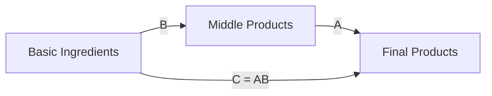
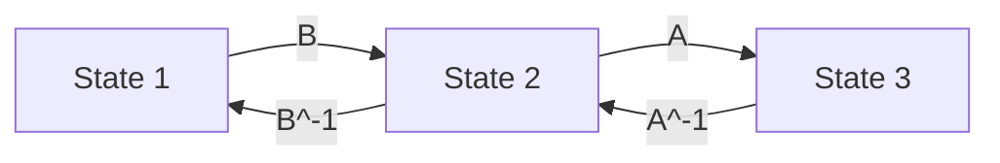

# Week 1: Matrix Arithmetic

> **Topics**: §1.1–1.2 — Matrix Product, Row and Column Operations
> **Date**: Feb 23–26, 2026

---

## Introduction

This week introduces the foundational concepts of matrix computation. We develop **three complementary views** of the matrix product $AB = C$, which will recur throughout the entire course. Understanding matrices through multiple interpretations is central to the pedagogical approach of this course.

> [!RMK]
> **Central Philosophy**: A matrix is not just a static grid of numbers. It represents transformations, linear combinations, and structured operations. By viewing the same object from different angles, we gain deeper insight and computational flexibility.

---

## §1.1 Matrix Product $AB = C$

### Three Interpretations of $AB = C$

The product $AB = C$ can be understood in three distinct but equivalent ways:

#### (x) Please add a direct computation formula and example!!!!

#### (a) Column View

> [!PROP]
> **Column Perspective of Matrix Multiplication**
>
> The $i$-th column of $C$ is a linear combination of the columns of $A$, with coefficients from the $i$-th column of $B$.

Mathematically, if $\mathbf{b}_i$ is the $i$-th column of $B$, then:
$$C = A\begin{pmatrix}
| & | &  & | \\
\mathbf{b}_1 & \mathbf{b}_2 & \cdots & \mathbf{b}_n \\
| & | &  & |
\end{pmatrix}
=
\begin{pmatrix}
| & | &  & | \\
A\mathbf{b}_1 & A\mathbf{b}_2 & \cdots & A\mathbf{b}_n \\
| & | &  & |
\end{pmatrix}$$
Please add here the exact explaination of Ab_1 means!!!! by expand writing b_1 as coefficients and A as columns!!! A = (|a_1|,|a_2..
> [!EXA]
> **Computing one column at a time**
>
> Let $A = \begin{pmatrix} 1 & 2 \\ 3 & 4 \end{pmatrix}$ and $B = \begin{pmatrix} 5 & 7 \\ 6 & 8 \end{pmatrix}$.
>
>  In this examples, b1= , b2=
>
> The first column of $C = AB$ is:
> $$Ab1=A\begin{pmatrix} 5 \\ 6 \end{pmatrix} = \begin{pmatrix} 1 & 2 \\ 3 & 4 \end{pmatrix}\begin{pmatrix} 5 \\ 6 \end{pmatrix} = 5\begin{pmatrix} 1 \\ 3 \end{pmatrix} + 6\begin{pmatrix} 2 \\ 4 \end{pmatrix} = \begin{pmatrix} 17 \\ 39 \end{pmatrix}$$
>
> This is a **linear combination** of the columns of $A$ with weights $5$ and $6$.

---

#### (b) Row View

> [!PROP]
> **Row Perspective of Matrix Multiplication**
>
> The $i$-th row of $C$ is a linear combination of the rows of $B$, with coefficients from the $i$-th row of $A$.

If $\mathbf{a}_i^T$ is the $i$-th row of $A$, then:
$$C=\begin{pmatrix}
- \mathbf{a}_1^T - \\
- \mathbf{a}_2^T - \\
\vdots \\
- \mathbf{a}_m^T -
\end{pmatrix}B
=
\begin{pmatrix}
- \mathbf{a}_1^T B - \\
- \mathbf{a}_2^T B - \\
\vdots \\
- \mathbf{a}_m^T B -
\end{pmatrix}$$

> [!EXA]
> **Computing one row at a time**
>
> Using the same $A$ and $B$ from before, the first row of $C$ is:
> $$\begin{pmatrix} 1 & 2 \end{pmatrix}\begin{pmatrix} 5 & 7 \\ 6 & 8 \end{pmatrix} = 1\begin{pmatrix} 5 & 7 \end{pmatrix} + 2\begin{pmatrix} 6 & 8 \end{pmatrix} = \begin{pmatrix} 17 & 23 \end{pmatrix}$$
>
> This is a **linear combination** of the rows of $B$ with weights $1$ and $2$.

---

#### (c) Sum-of-Rank-One View

YOU have to write more specificaalyyy!!!1

> [!PROP]
> **Sum-of-Rank-One Decomposition**
>
> The product $AB$ can be written as a sum of rank-one matrices:
> $$AB = \sum_{k=1}^{r} (\text{column } k \text{ of } A) \times (\text{row } k \text{ of } B)$$

Each term $\mathbf{a}_k \mathbf{b}_k^T$ is a **rank-one matrix** (outer product of two vectors).

> [!RMK]
> This is the **additive view** of matrices mentioned in the course philosophy. We will develop this perspective extensively when we introduce the **cross-filling method** in §1.3.

> [!EXA]
> **Decomposing a product into rank-one pieces**
>
> $$\begin{pmatrix} 1 & 2 \\ 3 & 4 \end{pmatrix}\begin{pmatrix} 5 & 7 \\ 6 & 8 \end{pmatrix} = \begin{pmatrix} 1 \\ 3 \end{pmatrix}\begin{pmatrix} 5 & 7 \end{pmatrix} + \begin{pmatrix} 2 \\ 4 \end{pmatrix}\begin{pmatrix} 6 & 8 \end{pmatrix}$$
>
> $$= \begin{pmatrix} 5 & 7 \\ 15 & 21 \end{pmatrix} + \begin{pmatrix} 12 & 16 \\ 24 & 32 \end{pmatrix} = \begin{pmatrix} 17 & 23 \\ 39 & 53 \end{pmatrix}$$

---

### The Ingredient Table Metaphor
You have to be more specific here!!!
> [!RMK]
> **Interpreting $C = AB$ as a production process**
>
> - $A$: Converts **basic ingredients** $\to$ **middle products**
> - $B$: Converts **middle products** $\to$ **final products**
> - $C = AB$: Direct conversion from **basic ingredients** $\to$ **final products**
>
> This metaphor clarifies the composition nature of matrix multiplication.

---

### Row and Column Operations on Products

> [!PROP]
> **Operations on Matrix Products**
>
> 1. Changing **basic ingredients** = **Row operations** on $A$ and $C$ (leave $B$ unchanged)
> 2. Changing **final products** = **Column operations** on $B$ and $C$ (leave $A$ unchanged)

> [!RMK]
> This observation is foundational: **row operations correspond to left multiplication, column operations correspond to right multiplication**. We will formalize this in §1.2.

---

## Inverse Matrices

### Definition and Basic Properties

> [!PROP]
> **Definition of Matrix Inverse**
>
> A square matrix $A$ is **invertible** if there exists a matrix $A^{-1}$ such that:
> $$A^{-1}A = I \quad \text{and} \quad AA^{-1} = I$$

> [!LEM]
> **Only square matrices can have inverses**
>
> **Proof**: Suppose $A$ is $m \times n$ and has an inverse $B$ (which must be $n \times m$). Then:
> $$AB = I_m \quad \text{and} \quad BA = I_n$$
>
> Taking traces:
> $$\text{tr}(AB) = \text{tr}(I_m) = m$$
> $$\text{tr}(BA) = \text{tr}(I_n) = n$$
>
> But the trace is cyclic: $\text{tr}(AB) = \text{tr}(BA)$. Therefore, $m = n$. ∎

> [!RMK]
> This proof uses the **trace** (sum of diagonal elements) and its cyclic property: $\text{tr}(AB) = \text{tr}(BA)$. This is one of the few algebraic tools we need at this early stage.

---

### Inverse of a Product

> [!PROP]
> **Inverse of a Product (Socks and Shoes)**
>
> If $A$ and $B$ are both invertible, then:
> $$(AB)^{-1} = B^{-1}A^{-1}$$
>
> **Proof**: Verify both directions:
> $$(AB)(B^{-1}A^{-1}) = A(BB^{-1})A^{-1} = AIA^{-1} = AA^{-1} = I$$
> $$(B^{-1}A^{-1})(AB) = B^{-1}(A^{-1}A)B = B^{-1}IB = B^{-1}B = I$$

> [!RMK]
> **Why "socks and shoes"?**
>
> To undo putting on socks and then shoes, you must reverse the order: remove shoes first, then socks. Similarly, to invert a product $AB$, you invert $B$ first, then $A$.

---

### Invariance Under Simultaneous Operations

> [!PROP]
> **Products unchanged by simultaneous operations**
>
> 1. **$A^{-1}B$ is invariant** under the same row operations on $A$ and $B$
>    - Since $A(A^{-1}B) = B$, row ops on both sides preserve the equation
>
> 2. **$AB^{-1}$ is invariant** under the same column operations on $A$ and $B$
>    - Since $(AB^{-1})B = A$, column ops on both sides preserve the equation

Visual representation:

- For $A^{-1}B$: $$\begin{array}{ccc} 3 & \xrightarrow{A} & 2 & \xleftarrow{B} & 1 \end{array}$$
- For $AB^{-1}$: $$\begin{array}{ccc} 3 & \xleftarrow{A} & 2 & \xrightarrow{B} & 1 \end{array}$$

> [!RMK]
> This property will be extremely useful when simplifying expressions involving inverses. Instead of computing $A^{-1}$ explicitly, we can manipulate $A$ via row operations and track the effect on the entire expression.

---

## §1.2 Row and Column Operations

### Two Interpretations of $AB = C$

> [!PROP]
> **$AB = C$ encodes instructions in two ways**
>
> **Row Perspective**:
> - Start with $IB = B$
> - Apply row operations to the left factor $I$, transforming it into $A$
> - Apply the same row operations to $B$, transforming it into $C$
> - Result: $AB = C$
> - **Interpretation**: $A$ encodes **row operation instructions** that transform $B$ into $C$
>
> **Column Perspective**:
> - Start with $AI = A$
> - Apply column operations to the right factor $I$, transforming it into $B$
> - Apply the same column operations to $A$, transforming it into $C$
> - Result: $AB = C$
> - **Interpretation**: $B$ encodes **column operation instructions** that transform $A$ into $C$

> [!RMK]
> This dual perspective shows that **matrices are operators**. Left multiplication performs row operations; right multiplication performs column operations. The identity matrix $I$ is the "neutral" operator that does nothing.

---

### Elementary vs. Non-Invertible Operations

> [!PROP]
> **Three elementary (invertible) row/column operations**
>
> 1. **Swap** two rows (or columns)
> 2. **Scale** a row (or column) by a nonzero constant
> 3. **Add** a multiple of one row (or column) to another
>
> Each of these operations has a **reverse operation**, so no information is lost.

> [!PROP]
> **Three non-invertible operations**
>
> 1. **Copy** a row (or column)
> 2. **Delete** a row (or column)
> 3. **Scale by zero** (multiply a row/column by 0)
>
> These operations **lose information permanently** and cannot be undone.

> [!EXA]
> **Elementary operations are reversible**
>
> - Swap rows 1 and 2 → Reverse: Swap rows 1 and 2 again
> - Multiply row 1 by 5 → Reverse: Multiply row 1 by $\frac{1}{5}$
> - Add 3 times row 2 to row 1 → Reverse: Add $-3$ times row 2 to row 1

> [!RMK]
> Elementary operations correspond to **invertible matrices** (elementary matrices). Non-invertible operations correspond to matrices with no inverse. This is why Gaussian elimination uses only elementary operations — they preserve the solution set of a linear system.

---

### Finding $A^{-1}$ Without Augmented Matrices

Traditional textbooks teach computing $A^{-1}$ using augmented matrices $[A | I]$. This course takes a different approach.

> [!PROP]
> **Row Operation Method for $A^{-1}$**
>
> 1. Write $A^{-1} = A^{-1} \cdot I$
> 2. Apply elementary row operations to both $A$ and $I$ simultaneously
> 3. Continue until $A$ becomes $I$
> 4. Cancel $I^{-1} = I$ from the left side
> 5. Whatever $I$ transforms into on the right side is $A^{-1}$

> [!PROP]
> **Column Operation Method for $A^{-1}$**
>
> 1. Write $A^{-1} = I \cdot A^{-1}$
> 2. Apply elementary column operations to both $A$ and $I$ simultaneously
> 3. Continue until $A$ becomes $I$
> 4. Cancel $I^{-1} = I$ from the right side
> 5. Whatever $I$ transforms into on the left side is $A^{-1}$

> [!EXA]
> **Computing $A^{-1}$ using row operations**
>
> Let $A = \begin{pmatrix} 1 & 2 \\ 3 & 4 \end{pmatrix}$. We want to find $A^{-1}$.
>
> Start with $A^{-1} = A^{-1} \cdot I$:
> $$\begin{pmatrix} 1 & 2 \\ 3 & 4 \end{pmatrix}^{-1} = \begin{pmatrix} 1 & 2 \\ 3 & 4 \end{pmatrix}^{-1} \begin{pmatrix} 1 & 0 \\ 0 & 1 \end{pmatrix}$$
>
> **Step 1**: Subtract 3 times row 1 from row 2:
> $$\begin{pmatrix} 1 & 2 \\ 0 & -2 \end{pmatrix}^{-1} = \begin{pmatrix} 1 & 2 \\ 0 & -2 \end{pmatrix}^{-1} \begin{pmatrix} 1 & 0 \\ -3 & 1 \end{pmatrix}$$
>
> **Step 2**: Multiply row 2 by $-\frac{1}{2}$:
> $$\begin{pmatrix} 1 & 2 \\ 0 & 1 \end{pmatrix}^{-1} = \begin{pmatrix} 1 & 2 \\ 0 & 1 \end{pmatrix}^{-1} \begin{pmatrix} 1 & 0 \\ \frac{3}{2} & -\frac{1}{2} \end{pmatrix}$$
>
> **Step 3**: Subtract 2 times row 2 from row 1:
> $$\begin{pmatrix} 1 & 0 \\ 0 & 1 \end{pmatrix}^{-1} = \begin{pmatrix} 1 & 0 \\ 0 & 1 \end{pmatrix}^{-1} \begin{pmatrix} -2 & 1 \\ \frac{3}{2} & -\frac{1}{2} \end{pmatrix}$$
>
> **Step 4**: Cancel $I^{-1} = I$:
> $$A^{-1} = \begin{pmatrix} -2 & 1 \\ \frac{3}{2} & -\frac{1}{2} \end{pmatrix}$$

> [!RMK]
> **When should you compute $A^{-1}$ explicitly?**
>
> Only when the problem explicitly requires the matrix form of $A^{-1}$. In most cases, when simplifying expressions like $A^{-1}B$ or $BA^{-1}$, it is more efficient to **operate directly on the expression** rather than computing $A^{-1}$ first.

---

## Summary and Looking Ahead

This week we established three fundamental perspectives on matrix multiplication:

1. **Column view**: $C$'s columns are linear combinations of $A$'s columns
2. **Row view**: $C$'s rows are linear combinations of $B$'s rows
3. **Sum-of-rank-one view**: $C$ is a sum of outer products

We also learned:
- Only square matrices can have inverses
- Elementary operations are reversible, non-elementary operations lose information
- Row operations = left multiplication, column operations = right multiplication
- How to find $A^{-1}$ using row or column operations (without augmented matrices)

> [!RMK]
> **Next week preview: The Cross-Filling Method**
>
> The sum-of-rank-one view is the gateway to the **cross-filling method**, the core computational technique of this course. Cross-filling unifies:
> - Rank-one decomposition
> - Matrix factorization $A = UV$
> - Rank computation
> - Solving linear systems $Ax = b$
>
> This single method replaces traditional Gaussian elimination with a more general and elegant framework.

---

## Exercises

1. Compute $AB$ using all three views (column, row, sum-of-rank-one) for:
   $$A = \begin{pmatrix} 2 & 1 \\ 0 & 3 \end{pmatrix}, \quad B = \begin{pmatrix} 1 & 4 \\ 2 & 0 \end{pmatrix}$$

2. Prove that $(A^{-1})^{-1} = A$ for any invertible matrix $A$.

3. Show that if $A$ and $B$ commute ($AB = BA$), then $(AB)^{-1} = A^{-1}B^{-1} = B^{-1}A^{-1}$.

4. Compute $A^{-1}$ using **column operations** for:
   $$A = \begin{pmatrix} 1 & 3 \\ 2 & 5 \end{pmatrix}$$

5. Verify that the sum-of-rank-one decomposition and the standard entry-wise computation give the same result for the matrices in Exercise 1.

---

*Last updated: 2026-02-20*
