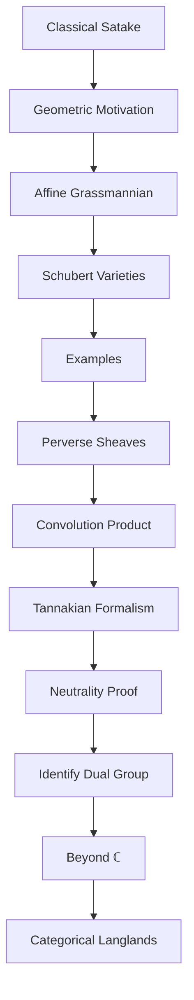

# Introduction to Geometric Satake Equivalence

**Lecture 0 - February 24, 2026**
**Speaker:** Qirui Li
**Location:** Room 404

## Overview

This seminar studies the **geometric Satake equivalence**, a fundamental result connecting representation theory and algebraic geometry. Our goal is to understand how perverse sheaves on the affine Grassmannian relate to representations of the Langlands dual group, opening the door to geometric Langlands and categorical Langlands programs.

## Motivation: Why Geometrize?

### Classical Satake Isomorphism

Let $G$ be a reductive group over a local field $\mathbb{Q}_p$ (or $\mathbb{F}_q((t))$), and $K = G(\mathbb{Z}_p)$ a maximal compact subgroup.

The **spherical Hecke algebra** is:
$$\mathcal{H}(G, K) = C_c^\infty(K \backslash G / K)$$
the algebra of compactly supported $K$-bi-invariant functions on $G$.

::: theorem
**Theorem (Classical Satake Isomorphism)**

There is an isomorphism of algebras:
$$\mathcal{H}(G, K) \simeq \mathbb{C}[X_*(T)]^W$$
where $T$ is a maximal torus, $X_*(T)$ is the cocharacter lattice, and $W$ is the Weyl group.
:::

**Key Insight:** The Hecke algebra, which classifies unramified representations of $G$, is controlled by Weyl group invariants.

**Question:** Where is the Langlands dual group $G^\vee$?
- It appears implicitly: $\mathbb{C}[X_*(T)]^W \simeq \mathbb{C}[X^*(T^\vee)]^{W^\vee}$ (roots and coroots switch roles)

### Limitations of Classical Approach

1. **Only unramified case**: Requires trivial representation on $K$
2. **No geometric intuition**: Algebraic construction doesn't reveal "why" $G^\vee$ appears
3. **Hard to generalize**: Difficult to extend to more general settings

### The Geometric Vision

**Idea:** Replace functions with sheaves, double cosets with geometric spaces.

| Classical | Geometric |
|-----------|-----------|
| $K \backslash G / K$ | Affine Grassmannian $\text{Gr}_G$ |
| Functions $C_c^\infty$ | Perverse sheaves $\text{Perv}$ |
| Convolution of functions | Convolution of sheaves |
| Hecke algebra | Monoidal category |
| Representations of $G^\vee$ | Objects in $\text{Rep}(G^\vee)$ |

## Main Theorem

::: theorem
**Theorem (Geometric Satake Equivalence)** *(Mirković-Vilonen, Ginzburg, Braverman-Finkelberg-Gaitsgory)*

Let $G$ be a complex reductive group, and $G^\vee$ its Langlands dual. Then there exists an equivalence of symmetric monoidal categories:

$$\text{Perv}_{G[[t]]}(\text{Gr}_G, k) \simeq \text{Rep}(G^\vee_k)$$

where:
- $\text{Gr}_G = G((t))/G[[t]]$ is the **affine Grassmannian**
- $\text{Perv}_{G[[t]]}(\text{Gr}_G, k)$ is the category of $G[[t]]$-equivariant perverse sheaves with coefficients in a field $k$
- $\text{Rep}(G^\vee_k)$ is the category of finite-dimensional representations of $G^\vee$ over $k$
- The equivalence is compatible with the **convolution product** on the left and **tensor product** on the right
:::

**Remarkable fact:** The dual group $G^\vee$ is **reconstructed geometrically** from the category of perverse sheaves!

## Key Concepts (Preview)

### 1. Affine Grassmannian $\text{Gr}_G$

**Definition (Coset Space):**
$$\text{Gr}_G = G((t)) / G[[t]]$$
where $G((t))$ = loop group, $G[[t]]$ = arc group.

**Moduli Interpretation:**
Points of $\text{Gr}_G$ classify $G$-bundles on the formal disk $\text{Spec}\, k[[t]]$ together with a trivialization on the punctured disk $\text{Spec}\, k((t))$.

**Example ($G = \text{GL}_n$):**
$$\text{Gr}_{\text{GL}_n} = \{ \text{lattices } L \subset k((t))^n \mid L \text{ commensurable with } k[[t]]^n \}$$

**Visualization:** Think of points in $\text{Gr}_G$ as "lattices deforming" - we can imagine how one lattice transforms into another.

**Structure:**
- $\text{Gr}_G$ is an ind-scheme (infinite-dimensional but built from finite-dimensional pieces)
- Stratified by **Schubert cells** $\text{Gr}_\lambda$ indexed by dominant coweights $\lambda \in X_*(T)^+$
- Has a convolution product structure

### 2. Perverse Sheaves

**Naive idea:** Perverse sheaves are "cohomology-like" objects in the derived category.

**More precisely:**
- Defined via a **t-structure** on $D^b_c(X, k)$ (bounded constructible derived category)
- The "heart" of this t-structure is $\text{Perv}(X, k)$

**Key example: IC Sheaves**
- **Intersection Cohomology (IC) sheaves** on each Schubert variety $\overline{\text{Gr}_\lambda}$
- These form a natural basis for $\text{Perv}_{G[[t]]}(\text{Gr}_G, k)$

**Why "perverse"?**
- They satisfy dimension conditions that seem "backwards" (hence "perverse")
- But they are the "right" objects for studying singular spaces

### 3. Convolution Product

**Setup:** Consider the diagram
$$\text{Gr}_G \times^{G[[t]]} \text{Gr}_G \xrightarrow{m} \text{Gr}_G$$
where $m$ is the "multiplication" map (combining two lattice deformations).

**Convolution of sheaves:**
For $\mathcal{F}_1, \mathcal{F}_2 \in \text{Perv}_{G[[t]]}(\text{Gr}_G, k)$:
$$\mathcal{F}_1 \star \mathcal{F}_2 = m_!(\mathcal{F}_1 \boxtimes \mathcal{F}_2)$$

**Fact:** This makes $\text{Perv}_{G[[t]]}(\text{Gr}_G, k)$ into a **symmetric monoidal category**.

### 4. Langlands Dual Group $G^\vee$

**Definition:** The Langlands dual $G^\vee$ is the complex reductive group obtained by:
- Swapping roots and coroots: $\Phi(G) \leftrightarrow \Phi^\vee(G^\vee)$
- Character lattice and cocharacter lattice switch: $X^*(T) \leftrightarrow X_*(T^\vee)$

**Examples:**
| $G$ | $G^\vee$ |
|-----|----------|
| $\text{GL}_n$ | $\text{GL}_n$ |
| $\text{SL}_n$ | $\text{PGL}_n$ |
| $\text{Sp}_{2n}$ | $\text{SO}_{2n+1}$ |
| $\text{SO}_{2n}$ | $\text{SO}_{2n}$ |

**Why does it appear?**
The geometric Satake equivalence shows that $G^\vee$ is the **Tannakian group** of the monoidal category $\text{Perv}_{G[[t]]}(\text{Gr}_G, k)$.

### 5. Tannakian Reconstruction

::: theorem
**Key Principle (Tannakian Formalism)**

A neutral Tannakian category over $k$ is equivalent to $\text{Rep}(H)$ for some algebraic group $H$ over $k$.

The group $H$ can be **reconstructed** from the category via the **fiber functor**.
:::

**Strategy for Geometric Satake:**
1. Show $\text{Perv}_{G[[t]]}(\text{Gr}_G, k)$ is a neutral Tannakian category
2. Reconstruct the group from this category
3. Identify it as $G^\vee_k$

## Proof Strategy Overview

**Critical philosophical point:** The Langlands dual group $G^\vee$ is **not assumed a priori**. It is **reconstructed** from the categorical structure of perverse sheaves via Tannakian formalism. This is an **intrinsic** approach.

The proof follows the Tannakian reconstruction strategy (Mirković-Vilonen):

### Step 1: Symmetric Monoidal Structure
Show that $\text{Perv}_{G[[t]]}(\text{Gr}_G, k)$ is a symmetric monoidal category:
- Define **convolution product**: $\mathcal{F}_1 \star \mathcal{F}_2 = m_!(\mathcal{F}_1 \boxtimes \mathcal{F}_2)$
- Prove **associativity** and **commutativity** constraints
- Identify **unit object**: $\mathbb{1} = \text{IC}_{\text{pt}}$ (IC sheaf of the base point)

**Key geometric input:** The convolution diagram and properties of the multiplication map on $\text{Gr}_G$.

### Step 2: Construct Fiber Functor
This is the **most technically challenging step**.

Define the fiber functor $\omega: \text{Perv}_{G[[t]]}(\text{Gr}_G, k) \to \text{Vect}_k$ by:
$$\omega(\mathcal{F}) = \mathcal{H}^0(\text{Gr}_G, \mathcal{F})$$
(the global cohomology in degree 0)

Must prove:
- **Exactness**: $\omega$ is an exact functor
- **Compatibility with $\star$**: $\omega(\mathcal{F}_1 \star \mathcal{F}_2) \simeq \omega(\mathcal{F}_1) \otimes \omega(\mathcal{F}_2)$
- **Faithfulness**: $\omega$ is faithful

**Key technical tool:** Weight functors and dimension estimates on Schubert varieties.

### Step 3: Prove Neutrality (Tannakian Properties)
Verify all axioms of a neutral Tannakian category:
- Abelian category with enough projectives
- $\text{End}(\mathbb{1}) = k$ (the unit object has endomorphisms = $k$)
- Every object has a dual
- **Semisimplicity** (for appropriate coefficients)

The fiber functor $\omega$ makes the category **neutral**.

### Step 4: Tannakian Reconstruction
By **Tannakian formalism** (Deligne-Milne), a neutral Tannakian category over $k$ is equivalent to $\text{Rep}(H)$ for a unique algebraic group $H$ over $k$.

The group $H$ is reconstructed as:
$$H = \text{Aut}^\otimes(\omega)$$
the group of **tensor-preserving automorphisms** of the fiber functor.

At this point we have:
$$\text{Perv}_{G[[t]]}(\text{Gr}_G, k) \simeq \text{Rep}(H)$$
but we don't yet know what $H$ is!

### Step 5: Identify $H = G^\vee_k$
Now comes the identification. We must show the reconstructed group $H$ is precisely the Langlands dual $G^\vee_k$.

**Strategy:**
1. Define **weight functors**: For each $\lambda \in X_*(T)^+$,
   $$w_\lambda: \text{Perv}_{G[[t]]}(\text{Gr}_G, k) \to \text{Vect}_k$$
   $$w_\lambda(\mathcal{F}) = \mathcal{H}^0(\text{Gr}_\lambda, \mathcal{F}|_{\text{Gr}_\lambda})$$

2. Compute **weight spaces**: Show that $w_\lambda$ extracts the $\lambda$-weight space of representations

3. Verify **root system**: The root system of $H$ (computed from weight decomposition) matches the dual root system $\Phi^\vee(G)$

4. Check **Weyl group**: The Weyl group action on $X^*(H)$ matches $W(G)$

5. Conclude: $H \simeq G^\vee_k$

**The dual group emerges from geometry!**

## Learning Path Overview

Our 12-week seminar follows this logical structure:

**Part I (Weeks 1-2):** Classical foundations
**Part II (Weeks 3-5):** Affine Grassmannian geometry
**Part III (Weeks 6-7):** Perverse sheaves machinery
**Part IV (Weeks 8-10):** Main theorem proof
**Part V (Weeks 11-12):** Modern developments

## Prerequisites

### Expected Background

- **Algebraic Geometry:** Schemes, sheaves, derived categories (at Hartshorne level)
- **Representation Theory:** Reductive groups, Weyl groups, root systems
- **Algebraic Groups:** Basic structure theory of reductive groups
- **Category Theory:** Monoidal categories, functors, natural transformations

### Recommended Preparation

For those wanting to review:
- Reductive groups: Springer's *Linear Algebraic Groups*
- Sheaf theory: Iversen's *Cohomology of Sheaves*
- Perverse sheaves: de Cataldo-Migliorini survey (arXiv:0712.0349)

## Big Picture: Why Does This Matter?

### Connection to Langlands Program

The geometric Satake equivalence is a **local ingredient** in the geometric Langlands program.

**Classical Langlands (over local fields):**
Relates Galois representations to automorphic representations.

**Geometric Langlands (over function fields):**
Relates $\mathcal{D}$-modules on $\text{Bun}_G$ (moduli of $G$-bundles) to perverse sheaves.

**Geometric Satake provides:**
- A geometric understanding of the Langlands dual group
- The convolution structure needed for categorical formulations
- A template for "geometrizing" representation-theoretic statements

### Towards Categorical Langlands

Recent developments (Gaitsgory-Lurie, Fargues-Scholze):
- Extend geometric Satake to p-adic groups
- Develop categorical local Langlands
- Connect to arithmetic geometry via Shimura varieties

**This seminar's goal:** Understand the foundational geometric Satake result, so we can appreciate these modern developments.

## For the First Meeting (Feb 24)

### Agenda
1. **Introduction** (30 min): This overview
2. **Discussion** (30 min):
   - Background check: what do people know?
   - What aspects are most interesting?
3. **Speaker Assignment** (30 min): Assign talks 1-12
4. **Logistics** (15 min):
   - Note-taking responsibilities
   - References and resources
5. **Preview** (15 min): Look ahead to Talk 1 (Classical Satake)

### Preparation for Next Week

For those attending Talk 1 (Classical Satake Isomorphism):
- Read: Gross - *On the Satake isomorphism* (first 10 pages)
- Review: Spherical representations, Hecke algebras

## References for Introduction

1. **Zhu (2016)** - *An introduction to affine Grassmannians and the geometric Satake equivalence*, Introduction and §1
2. **Baumann-Riche (2017)** - *Notes on the geometric Satake equivalence*, Introduction
3. **Frenkel (2007)** - *Lectures on the Langlands Program and Conformal Field Theory*, arXiv:hep-th/0512172 (for big picture)
4. **Mirković-Vilonen (2007)** - *Geometric Langlands duality and representations of algebraic groups over commutative rings*, Annals of Math (the original proof)

---

*These notes will be updated after the first meeting with additional details and questions from participants.*
