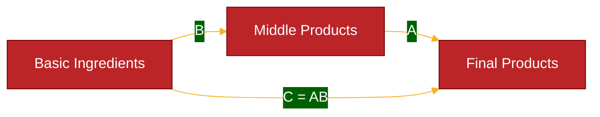

# Test 1: User's Custom Config Approach

> **Approach**: Use `base` theme with custom color variables defined per diagram
> **Pros**: Full control over colors, can match site branding
> **Cons**: Verbose config block needed for every diagram

---

## Configuration Used

```yaml
config:
  theme: 'base'
  themeVariables:
    primaryColor: '#BB2528'
    primaryTextColor: '#fff'
    primaryBorderColor: '#7C0000'
    lineColor: '#F8B229'
    secondaryColor: '#006100'
    tertiaryColor: '#fff'
```

---

## Test Diagram



---

## Evaluation

**Light Mode**: ⬜ (test in browser)

**Dark Mode**: ⬜ (test in browser)

**Aesthetics**: Custom red/yellow color scheme

**Maintenance**: ⚠️ HIGH — requires copy-pasting config block to every diagram

**Notes**: Colors are hard-coded. Works well if you want consistent branding across all diagrams.
