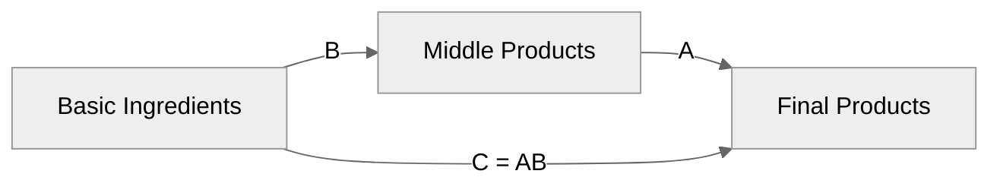

# Test 3: Neutral Theme

> **Approach**: Use Mermaid's built-in `neutral` theme
> **Pros**: Designed to work in both light and dark modes
> **Cons**: May be less vibrant than custom colors

---

## Configuration Used

```yaml
config:
  theme: 'neutral'
```

---

## Test Diagram



---

## Evaluation

**Light Mode**: ⬜ (test in browser)

**Dark Mode**: ⬜ (test in browser)

**Aesthetics**: Neutral grays and muted colors

**Maintenance**: ✅ LOW — only 2 lines of config

**Notes**: This theme is designed for neutral backgrounds. Good compromise between light/dark compatibility.
