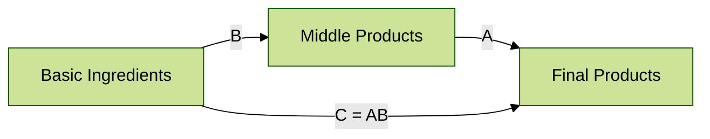

# Test 4: Forest Theme

> **Approach**: Use Mermaid's built-in `forest` theme
> **Pros**: Green color scheme, visually distinct
> **Cons**: May clash with site colors, questionable dark mode support

---

## Configuration Used

```yaml
config:
  theme: 'forest'
```

---

## Test Diagram



---

## Evaluation

**Light Mode**: ⬜ (test in browser)

**Dark Mode**: ⬜ (test in browser)

**Aesthetics**: Green-based color scheme

**Maintenance**: ✅ LOW — only 2 lines of config

**Notes**: Interesting alternative, but green may not fit the mathematical content theme.
