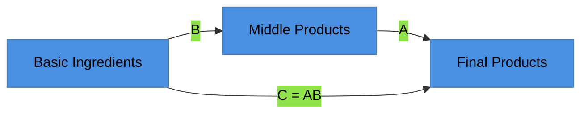

# Test 5: Base Theme with Minimal Config

> **Approach**: Use `base` theme but only override essential colors for dark mode compatibility
> **Pros**: Balance between customization and simplicity
> **Cons**: Still requires some config per diagram

---

## Configuration Used

```yaml
config:
  theme: 'base'
  themeVariables:
    primaryColor: '#4A90E2'
    primaryTextColor: '#000'
    lineColor: '#333'
```

Minimal set: only 3 variables instead of 6+

---

## Test Diagram



---

## Evaluation

**Light Mode**: ⬜ (test in browser)

**Dark Mode**: ⬜ (test in browser)

**Aesthetics**: Blue nodes with black text, dark gray lines

**Maintenance**: ⚠️ MEDIUM — requires 5 lines of config, but less than Test 1

**Notes**: Compromise between full customization and built-in themes. Uses fewer variables than the full custom approach.
