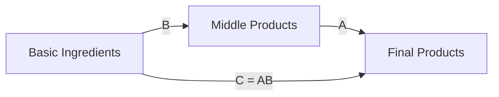

# Test 6: No Custom Config (Default)

> **Approach**: Use Mermaid's default rendering with no theme config
> **Pros**: Zero configuration, maximum simplicity
> **Cons**: This is the **baseline problem** — poor dark mode support

---

## Configuration Used

None — default Mermaid rendering.

---

## Test Diagram

---

## Evaluation

**Light Mode**: ⬜ (test in browser) — Should work fine

**Dark Mode**: ❌ (known issue) — Poor contrast, hard to read

**Aesthetics**: Mermaid's default blue color scheme

**Maintenance**: ✅ ZERO — no config needed

**Notes**: This is the current state. We're testing alternatives to replace this.

---

## Known Issues with Default

- Light text on light background (or dark on dark) in some browser themes
- No adaptation to system dark mode
- Inconsistent across different browser rendering
