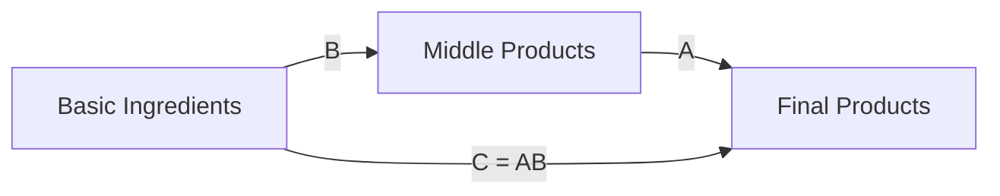

# Test 7: Global Configuration Approach

> **Approach**: Set Mermaid theme globally in `index.html` instead of per-diagram
> **Pros**: Zero config per diagram, centralized control
> **Cons**: Requires modifying index.html, affects all diagrams site-wide

---

## How It Works

Add to `index.html` before Mermaid initialization:

```javascript
window.mermaidConfig = {
  startOnLoad: true,
  theme: 'neutral',  // or 'dark', 'base', etc.
  themeVariables: {
    // optional custom variables
  }
};
```

Then initialize Mermaid with:
```javascript
mermaid.initialize(window.mermaidConfig);
```

---

## Test Diagram (No Config Needed)



---

## Implementation Status

⚠️ **Not implemented yet** — requires changes to `index.html`

To test this approach:
1. Modify `index.html` to add global Mermaid config
2. Reload all test pages
3. Verify all diagrams inherit the global theme

---

## Evaluation

**Light Mode**: ⬜ (requires implementation)

**Dark Mode**: ⬜ (requires implementation)

**Aesthetics**: Depends on chosen global theme

**Maintenance**: ✅ ZERO per diagram — change once in index.html, affects all diagrams

**Notes**: Best approach if all diagrams should have consistent styling. No need to add config blocks to individual diagrams.

---

## Recommended Global Config

If implementing this approach, recommend using:

```javascript
window.mermaidConfig = {
  startOnLoad: true,
  theme: 'neutral',  // works in both light and dark modes
  flowchart: {
    useMaxWidth: true,
    htmlLabels: true
  }
};
```

Or for custom branding:

```javascript
window.mermaidConfig = {
  startOnLoad: true,
  theme: 'base',
  themeVariables: {
    primaryColor: '#4A90E2',
    primaryTextColor: '#000',
    primaryBorderColor: '#2E5C8A',
    lineColor: '#666',
    secondaryColor: '#A8D08D',
    tertiaryColor: '#fff'
  }
};
```
