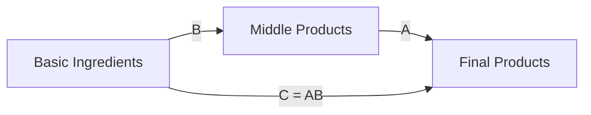

# Test 8: CSS Override Approach

> **Approach**: Use custom CSS to force Mermaid diagram colors regardless of theme
> **Pros**: No config in markdown, works globally
> **Cons**: Fragile (depends on Mermaid's DOM structure), may break on updates

---

## How It Works

Add custom CSS to force specific colors on Mermaid-generated elements:

```css
/* In index.html or a separate CSS file */

/* Force node fill colors */
.mermaid .node rect,
.mermaid .node circle,
.mermaid .node polygon {
  fill: #4A90E2 !important;
  stroke: #2E5C8A !important;
}

/* Force text colors */
.mermaid .nodeLabel,
.mermaid .edgeLabel {
  color: #000 !important;
  fill: #000 !important;
}

/* Force line/arrow colors */
.mermaid .edgePath .path {
  stroke: #666 !important;
}

/* Dark mode overrides */
@media (prefers-color-scheme: dark) {
  .mermaid .nodeLabel,
  .mermaid .edgeLabel {
    color: #fff !important;
    fill: #fff !important;
  }

  .mermaid .edgePath .path {
    stroke: #aaa !important;
  }
}
```

---

## Test Diagram (No Config Needed)



---

## Implementation Status

⚠️ **Not implemented yet** — requires adding CSS to index.html or separate stylesheet

---

## Evaluation

**Light Mode**: ⬜ (requires implementation)

**Dark Mode**: ⬜ (requires implementation)

**Aesthetics**: Fully customizable via CSS

**Maintenance**: ⚠️ MEDIUM — CSS may break if Mermaid changes its DOM structure

**Notes**: This is a "nuclear option" — forces styling regardless of Mermaid's theme system. Use only if other approaches fail.

---

## Pros and Cons

### Pros
- Zero markdown config needed
- Works globally across all diagrams
- Can use CSS media queries to adapt to system dark mode
- Fine-grained control over every element

### Cons
- Brittle: depends on Mermaid's internal CSS class names
- May break when Mermaid updates
- Harder to debug if styles conflict
- Overrides all diagram-specific theming

---

## When to Use This Approach

Use CSS override when:
- You need automatic dark mode detection (`prefers-color-scheme`)
- Global config doesn't provide enough control
- You want different styles for different diagram types
- You're okay with potential maintenance burden

**Don't use when:**
- Built-in themes are sufficient
- You need per-diagram customization
- You want a maintainable long-term solution
