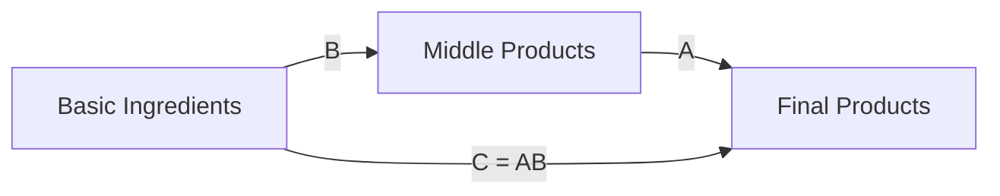

# Test 9: Hybrid Approach (Global + Per-Diagram Override)

> **Approach**: Set a sensible global default, but allow per-diagram overrides when needed
> **Pros**: Best of both worlds — low maintenance with flexibility
> **Cons**: Requires careful documentation of when to use overrides

---

## How It Works

1. **Set global default in index.html**:
   ```javascript
   window.mermaidConfig = {
     startOnLoad: true,
     theme: 'neutral'  // safe default for both modes
   };
   ```

2. **Override specific diagrams only when needed**:
   ```yaml
   config:
     theme: 'base'
     themeVariables:
       primaryColor: '#BB2528'
       # ... custom colors for special diagrams
   ```

---

## Test Diagram 1: Using Global Default (No Config)



---

## Test Diagram 2: Custom Override for Emphasis


---

## Implementation Status

⚠️ **Partially testable** — can use default now, global config requires index.html changes

---

## Evaluation

**Light Mode**: ⬜ (test in browser)

**Dark Mode**: ⬜ (test in browser)

**Aesthetics**: Consistent by default, customizable when needed

**Maintenance**: ✅ LOW — most diagrams have zero config, only special ones need customization

**Notes**: This is likely the **recommended approach** — set-and-forget for 95% of diagrams, customize the 5% that need special attention.

---

## Recommended Usage Guidelines

### Use Global Default (No Config) For:
- Simple flowcharts
- Process diagrams
- Standard lecture note illustrations
- Any diagram that doesn't need special emphasis

### Use Custom Config For:
- Diagrams that need to match specific branding
- Important theorems or key concepts that should stand out
- Diagrams used in presentations or publications
- Cases where you want specific color coding (e.g., red for errors, green for success)

---

## Proposed Global Config

```javascript
// In index.html
window.mermaidConfig = {
  startOnLoad: true,
  theme: 'neutral',  // works in light and dark modes
  themeVariables: {
    fontSize: '16px',
    fontFamily: 'system-ui, sans-serif'
  },
  flowchart: {
    useMaxWidth: true,
    htmlLabels: true,
    curve: 'basis'
  }
};
```

This gives a clean, readable default that works everywhere. Override only when you need specific colors.
