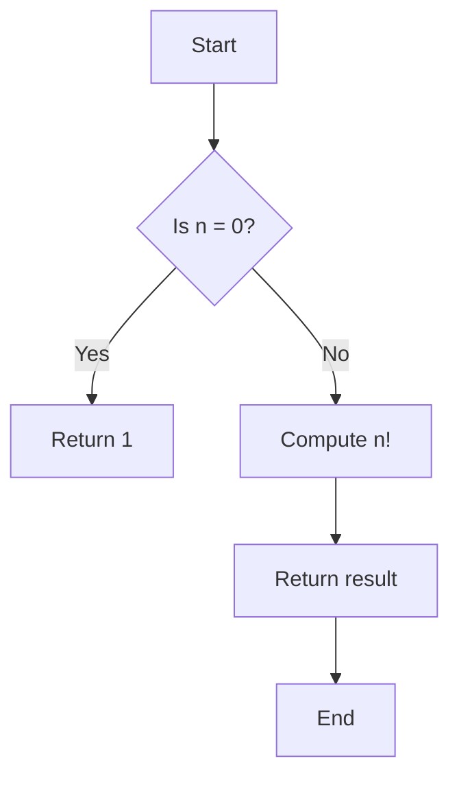
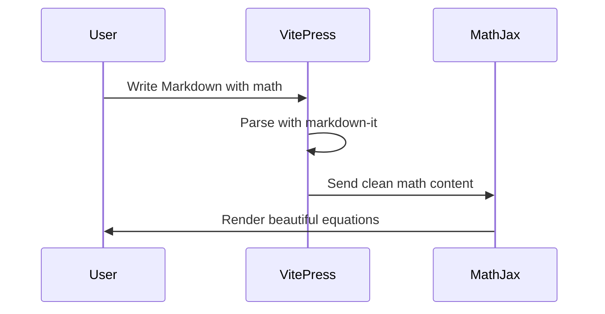
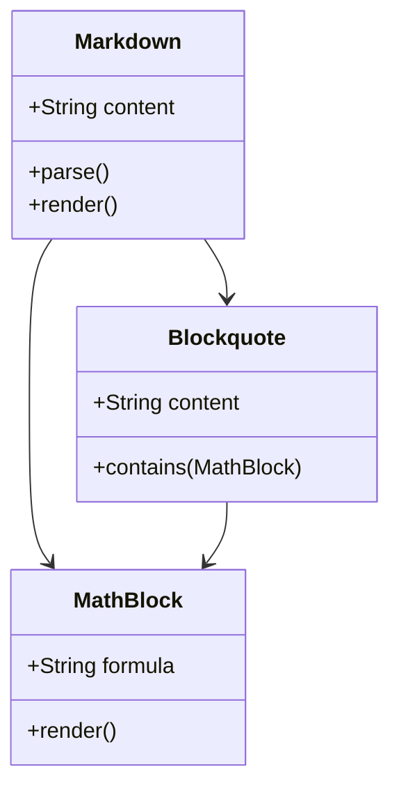
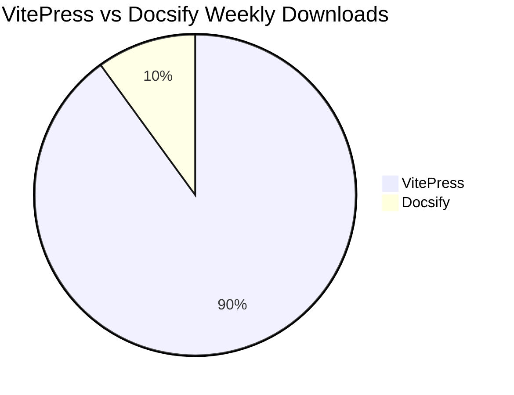
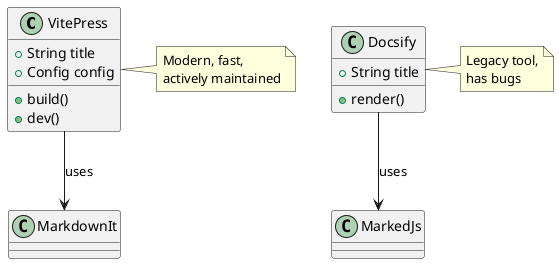
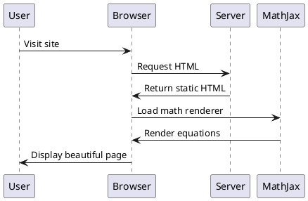

# Diagrams Test

Testing Mermaid and PlantUML diagram rendering in VitePress.

---

## Mermaid Diagrams

VitePress has **built-in Mermaid support**! No plugins needed.

### Flowchart

### Sequence Diagram

### Class Diagram

### Pie Chart

---

## PlantUML Diagrams

PlantUML support via `markdown-it-plantuml` plugin.

### Simple UML Class Diagram

### Sequence Diagram (PlantUML)

---

## Comparison with Docsify

| Feature | Docsify | VitePress |
|---------|---------|-----------|
| **Mermaid** | Plugin required (`docsify-mermaid`) | ✅ Built-in |
| **PlantUML** | Plugin required (`docsify-plantuml`) | ✅ markdown-it plugin |
| **Rendering** | Client-side (slow) | ✅ Build-time (fast) |
| **Caching** | Browser cache issues | ✅ Auto hash-busting |

---

## Test Status

::: tip Diagrams Working ✅
If you see rendered diagrams above (not code blocks), the test passed!
:::

---

## More Tests

- [Blockquote + Math](./blockquote-math)
- [Custom Alerts](./custom-alerts)
